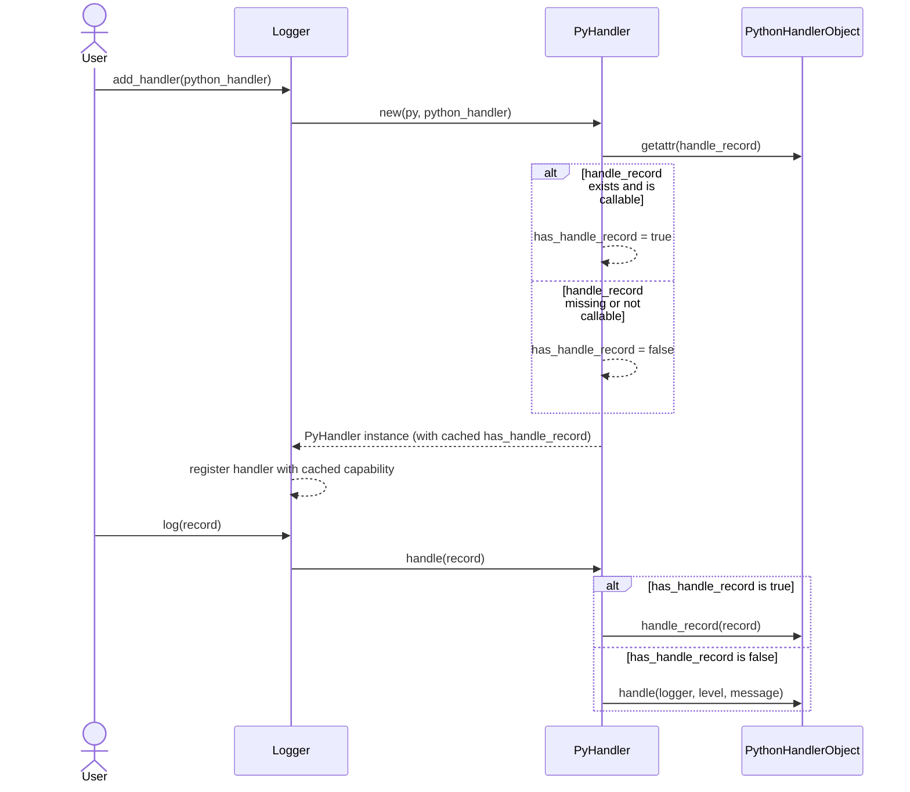
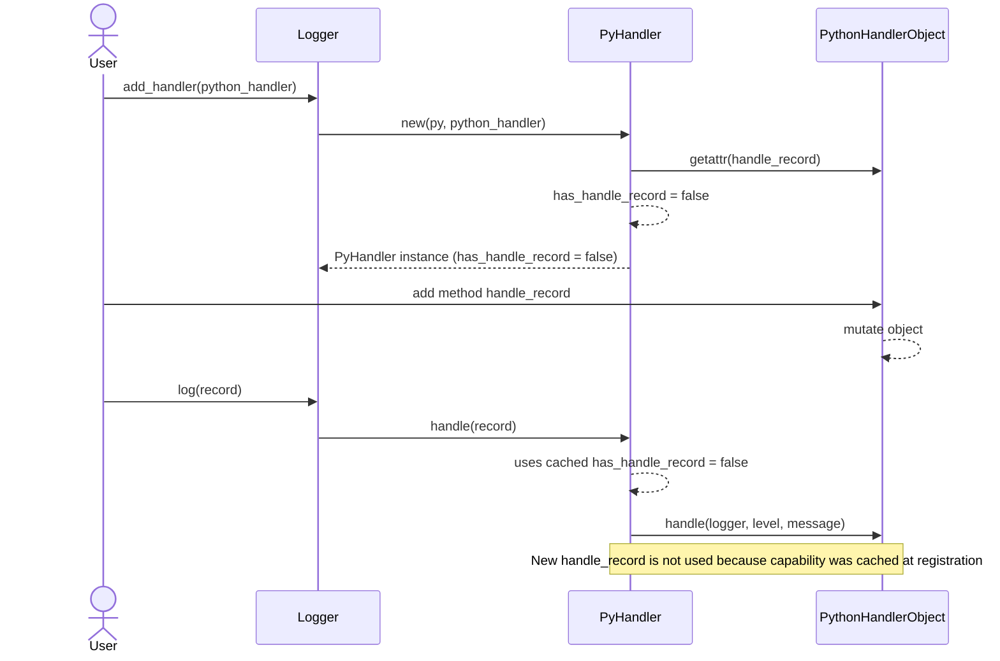

# Femtologging user guide

Femtologging is an asynchronous logging runtime for Python applications that
delegates IO and record fan-out to Rust worker threads. This guide covers the
features that are currently implemented, how they differ from the CPython
`logging` module, and the practical caveats you need to keep in mind when
building production systems on top of femtologging.

## Quick start

Install the package (a local editable installation is shown here) and emit your
first record:

```bash
pip install .
```

```python
from femtologging import FemtoStreamHandler, get_logger

logger = get_logger("demo.app")
logger.add_handler(FemtoStreamHandler.stderr())

logger.log("INFO", "hello from femtologging")
```

Handlers run in background threads, so remember to flush or close them before
your process exits.

## Architectural overview

- Each `FemtoLogger` owns a bounded queue (capacity 1 024) and a worker thread
  that drains records and invokes handlers. Calls to `logger.log()` simply
  enqueue a record and return immediately.
- Handlers (`FemtoStreamHandler`, `FemtoFileHandler`,
  `FemtoRotatingFileHandler`, and `FemtoSocketHandler`) also own dedicated
  queues and worker threads so file IO, stdout/stderr writes, and socket
  operations never block the calling code.
- When any queue is full, the record is dropped. Each component emits
  rate-limited warnings and maintains drop counters
  (`FemtoLogger.get_dropped()` and handler-specific warnings) so you can
  monitor pressure.
- Record metadata currently only tracks the logger name, level, message text,
  timestamps, and thread identity. The Python API does not yet expose rich
  `LogRecord` attributes such as the calling module or exception info.

## Working with loggers

### Creating and naming loggers

- Use `get_logger(name)` to obtain a singleton `FemtoLogger`. Names must not be
  empty, start or end with `.`, or contain consecutive dots.
- Logger parents are derived from dotted names. `get_logger("api.v1")` creates
  a parent `api` logger that ultimately propagates to `root`.
- Call `logger.set_propagate(False)` to stop parent propagation. The default is
  to bubble records to ancestors, just like the stdlib.
- `reset_manager()` clears all registered loggers. It is intended for tests and
  is not thread-safe.

### Emitting records

- `logger.log(level, message)` accepts the case-insensitive names `"TRACE"`,
  `"DEBUG"`, `"INFO"`, `"WARN"`, `"WARNING"`, `"ERROR"`, and `"CRITICAL"`.
- The method returns the formatted string when the record passes level checks
  (default format is `"{logger} [LEVEL] message"`), or `None` when the record
  is filtered out. This differs from `logging.Logger.log()`, which always
  returns `None`.
- Convenience methods (`logger.info`, `logger.warning`, and so on) are not
  implemented yet; call `log()` directly or wrap it in a helper.
- Currently, `FemtoLogger` sends only the text form of each record to handlers.
  There is no equivalent to `extra`, `exc_info`, `stack_info`, or lazy
  formatting. Build the final message string yourself before calling `log()`.

### Managing handlers and custom sinks

- The built-in handlers implement the Rust-side `FemtoHandlerTrait`. Python
  handlers can be attached by supplying any object that exposes a callable
  `handle(logger_name: str, level: str, message: str)` method.
- Python handlers run inside the logger’s worker thread. Ensure they are
  thread-safe and fast; slow handlers block the logger worker and can cause
  additional record drops.
- `logger.add_handler(handler)` accepts either a Rust-backed handler or a Python
  handler as described above. Use `logger.remove_handler(handler)` or
  `logger.clear_handlers()` to detach them. Removals only affect records that
  are enqueued after the call because previously queued items already captured
  their handler list.
- Use `logger.get_dropped()` to inspect how many records have been discarded
  because the logger queue was full or shutting down.

## Built-in handlers

### FemtoStreamHandler

- `FemtoStreamHandler.stderr()` (default) and `.stdout()` log to the respective
  standard streams. Calls return immediately; the handler thread flushes the
  underlying `io::Write`.
- `handler.flush()` waits (up to one second by default) for the worker to flush
  buffered writes and returns `True` on success. `handler.close()` shuts down
  the worker thread and should be called before process exit.
- To tune capacity, flush timeout, or formatters use `StreamHandlerBuilder`. It
  provides `.with_capacity(n)`, `.with_flush_timeout_ms(ms)`, and
  `.with_formatter(callable_or_id)` fluent methods before calling `.build()`.

### FemtoFileHandler

- Constructor signature:
  `FemtoFileHandler(path, capacity=1024, flush_interval=1, policy="drop")`. The
  flush interval counts _records_, not seconds.
- `policy` controls queue overflow handling:
  - `"drop"` (default) discards records and raises `RuntimeError`.
  - `"block"` blocks the caller until the worker makes room.
  - `"timeout:N"` blocks for `N` milliseconds before giving up.
- Use `handler.flush()` and `handler.close()` to ensure on-disk consistency.
  Always close the handler when the application shuts down.
- `FileHandlerBuilder` mirrors these options and also exposes
  `.with_overflow_policy(OverflowPolicy.drop()/block()/timeout(ms))` and
  `.with_formatter(…)`. Formatter identifiers other than `"default"` are not
  wired up yet; pass a callable (taking a mapping and returning a string) to
  attach custom formatting logic.

### FemtoRotatingFileHandler

- Wraps `FemtoFileHandler` with size-based rotation. Instantiate via
  `FemtoRotatingFileHandler(path, options=HandlerOptions(…))`.
- `HandlerOptions` fields:
  - `capacity`, `flush_interval`, and `policy` mirror `FemtoFileHandler`.
  - `rotation=(max_bytes, backup_count)` enables rollover when _both_ values
    are greater than zero. Set `(0, 0)` to disable rotation entirely.
- Rotation renames the active log file to `.1`, shifts older backups up to
  `backup_count`, and truncates the live file. If opening a fresh file fails
  the implementation falls back to appending to the existing file and logs the
  reason.
- `RotatingFileHandlerBuilder` provides the same fluent API as the file builder
  plus `.with_max_bytes()` and `.with_backup_count()`.

### FemtoSocketHandler

- Socket handlers must be built via `SocketHandlerBuilder`. Typical usage:

```python
from femtologging import BackoffConfig, SocketHandlerBuilder

socket_handler = (
    SocketHandlerBuilder()
    .with_tcp("127.0.0.1", 9020)
    .with_capacity(2048)
    .with_connect_timeout_ms(5000)
    .with_write_timeout_ms(1000)
    .with_tls("logs.example.com", insecure=False)
    .with_backoff(
        BackoffConfig(
            {
                "base_ms": 100,
                "cap_ms": 5000,
                "reset_after_ms": 30000,
                "deadline_ms": 120000,
            }
        )
    )
    .build()
)
```

- Default transport is TCP to `localhost:9020`. Call `.with_unix_path()` to use
  Unix sockets on POSIX systems. TLS only works with TCP transports; attempting
  to combine TLS and Unix sockets raises `HandlerConfigError`.
- Records are serialized to MessagePack maps:
  `{logger, level, message, timestamp_ns, filename, line_number, module_path,
    thread_id, thread_name, key_values}` and framed with a 4-byte big-endian
  length prefix.
- The worker reconnects automatically using exponential backoff. Payloads that
  exceed the configured `max_frame_size` are dropped.
- `handler.flush()` forces the worker to flush the active socket. Always call
  `handler.close()` to terminate the worker thread cleanly.

### Custom Python handlers

```python
class Collector:
    def __init__(self) -> None:
        self.records: list[tuple[str, str, str]] = []

    def handle(self, logger: str, level: str, message: str) -> None:
        # Runs inside the FemtoLogger worker thread
        self.records.append((logger, level, message))

collector = Collector()
logger.add_handler(collector)
```

The handler's `handle` method must be callable and thread-safe. Exceptions are
printed to stderr and counted as handler errors, so prefer defensive code and
avoid raising from `handle`.

#### Handler stability contract

Handler capabilities are inspected **once** when `add_handler()` is called:

- The presence of a callable `handle_record` method is cached at registration
  time and determines which dispatch path is used for all subsequent records.
- **Do not mutate the handler after calling `add_handler()`.** Adding or
  removing `handle_record` after registration has no effect and results in
  undefined behaviour.
- Ensure the handler is fully configured before passing it to `add_handler()`.

This design keeps per-record overhead low by avoiding repeated attribute
lookups on the hot path and aligns with the standard library expectation that
handlers are configured before use.

The following diagram shows how capability detection works at registration time
and how the cached result determines dispatch for all subsequent records:



_Figure 1: Capability detection at registration and dispatch based on cached
result._

This next diagram illustrates why mutating the handler after registration has
no effect—the capability was already cached:



_Figure 2: Mutating the handler after registration does not change dispatch
behaviour._

## Configuration options

### basicConfig

- Accepts `level`, `filename`, `stream` (`sys.stdout` or `sys.stderr`), `force`,
  and `handlers` (an iterable of handler objects) either via keyword arguments
  or the `BasicConfig` dataclass.
- `filename` and `stream` are mutually exclusive and cannot be combined with
  the `handlers` argument.
- Passing `force=True` clears existing handlers on the root logger before
  installing the new one.
- Formatting parameters (`format`, `datefmt`, and friends) are intentionally
  unsupported until formatter customization lands.

### ConfigBuilder (imperative API)

```python
from femtologging import (
    ConfigBuilder,
    LoggerConfigBuilder,
    StreamHandlerBuilder,
    FileHandlerBuilder,
    OverflowPolicy,
    LevelFilterBuilder,
)

builder = (
    ConfigBuilder()
    .with_handler("console", StreamHandlerBuilder.stderr())
    .with_handler(
        "audit",
        FileHandlerBuilder("/var/log/app.log").with_overflow_policy(
            OverflowPolicy.block()
        ),
    )
    .with_filter("info_only", LevelFilterBuilder().with_max_level("INFO"))
    .with_logger(
        "app.audit",
        LoggerConfigBuilder()
        .with_level("INFO")
        .with_handlers(["audit"])
        .with_filters(["info_only"])
        .with_propagate(False),
    )
    .with_root_logger(LoggerConfigBuilder().with_level("WARNING").with_handlers(["console"]))
)

builder.build_and_init()
```

- `with_default_level(level)` sets a fallback for loggers that omit explicit
  levels. `with_disable_existing_loggers(True)` clears handlers and filters on
  previously created loggers that are not part of the new configuration (their
  ancestors are preserved automatically).
- Only two filter builders exist today: `LevelFilterBuilder` and
  `NameFilterBuilder`. Filters are applied in the order they are declared in
  each `LoggerConfigBuilder`.
- Formatter registration (`with_formatter(id, FormatterBuilder)`) is currently
  a placeholder. Registered formatters are stored in the serialized config, but
  handlers still treat any string other than `"default"` as unknown and raise
  `HandlerConfigError`.

### dictConfig (restricted compatibility layer)

- Supported handler classes: `logging.StreamHandler`,
  `femtologging.StreamHandler`, `logging.FileHandler`,
  `femtologging.FileHandler`, `logging.handlers.RotatingFileHandler`, and
  `logging.handlers.SocketHandler` (plus their femtologging equivalents).
- Handler `args` are evaluated with `ast.literal_eval`, matching the stdlib
  behaviour for simple tuples. For socket handlers you can pass either
  `(host, port)` or a single Unix socket path; keyword arguments mirror the
  builder API (`host`, `port`, `unix_path`, `capacity`, `connect_timeout_ms`,
  `write_timeout_ms`, `max_frame_size`, `tls`, `tls_domain`, `tls_insecure`,
  `backoff_*` aliases).
- Unsupported stdlib features raise `ValueError`: incremental updates,
  top-level `filters` sections, handler `level`, handler `filters`, and handler
  formatters. Although the schema accepts a `formatters` section, referencing a
  formatter from a handler currently results in
  `ValueError("unknown formatter id")`.
- A `root` section is mandatory. Named loggers support `level`, `handlers`, and
  `propagate` (bool).

### fileConfig (INI compatibility)

- `fileConfig(path, defaults=None, disable_existing_loggers=True, encoding=None)`
  parses CPython-style INI files via the Rust extension and translates them to
  the restricted `dictConfig` schema.
- Default substitutions (`%(foo)s`) work across the INI file and any mapping
  you pass via `defaults`.
- Formatters and handler-level overrides are not supported. Including
  `[formatter_*]` sections or specifying `level`/`formatter` inside
  `[handler_*]` entries raises `ValueError`.

## Formatting and filtering

- Logger-level formatting is fixed (`"{logger} [LEVEL] message"`). To customize
  output wrap handlers with formatter callables using the builder API:

```python
def json_formatter(record: dict[str, object]) -> str:
    import json
    return json.dumps(
        {
            "logger": record["logger"],
            "level": record["level"],
            "message": record["message"],
        },
        separators=(",", ":"),
    )

stream = StreamHandlerBuilder.stdout().with_formatter(json_formatter).build()
```

- Formatter identifiers are limited to `"default"` for now. Future releases
  will connect `FormatterBuilder` and handler formatter IDs, but this is not
  yet implemented.
- Filters are only available through `ConfigBuilder`. `dictConfig` and
  `fileConfig` deliberately reject filter declarations so the limited,
  guaranteed-safe subset remains obvious.

## Deviations from stdlib logging

- No shorthand methods (`info`, `debug`, `warning`, …) or `LoggerAdapter`.
- `log()` returns the formatted string instead of `None`, and there is no
  `Logger.isEnabledFor()` helper.
- Records lack `extra`, `exc_info`, `stack_info`, and stack introspection.
- Handlers expect `handle(logger, level, message)` rather than `emit(LogRecord)`
  and run on dedicated worker threads, so Python `logging.Handler` subclasses
  cannot be reused.
- The `dictConfig` schema lacks incremental updates, filters, handler levels,
  and formatter attachment. `fileConfig` is likewise cut down.
- Queue capacity is capped (1 024 per logger/handler). The stdlib blocks the
  emitting thread; femtologging drops records and emits warnings instead.
- Formatting styles (`%`, `{}`, `$`) are not implemented. Provide the final
  string yourself, or supply a callable formatter per handler.
- The logging manager is separate from `logging`’s global state. Mixing both
  systems in the same process is unsupported.

## Operational tips and caveats

- Always flush or close handlers before shutting down the process; otherwise
  buffered records may be lost.
- Monitor `logger.get_dropped()` and the warnings emitted by each handler to
  detect back pressure early. Increase handler capacities or switch to
  blocking/timeout policies when drops are unacceptable.
- File-based handlers count `flush_interval` in _records_. If you need
  time-based flushing, add a periodic `handler.flush()` in your application.
- Blocking overflow policies affect the thread that calls `logger.log()`. Use
  them only when you are comfortable with logging back pressure slowing the
  producer because that is what will happen.
- Socket handlers serialize to MessagePack with a one-megabyte default frame
  limit. Large payloads are silently dropped; consider truncating or chunking
  messages before logging.
- `reset_manager()` is a destructive operation intended for tests. Do not call
  it while other threads might still hold references to existing loggers.

Keep an eye on the roadmap in `docs/` for upcoming additions (formatter
resolution, richer dictConfig support, timed rotation) and update your
configuration once those features land. For now, the patterns above reflect the
current, tested surface area of femtologging.
