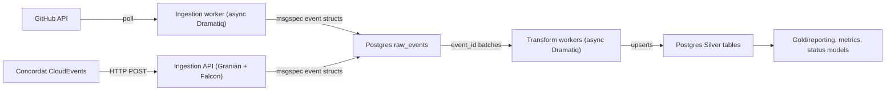
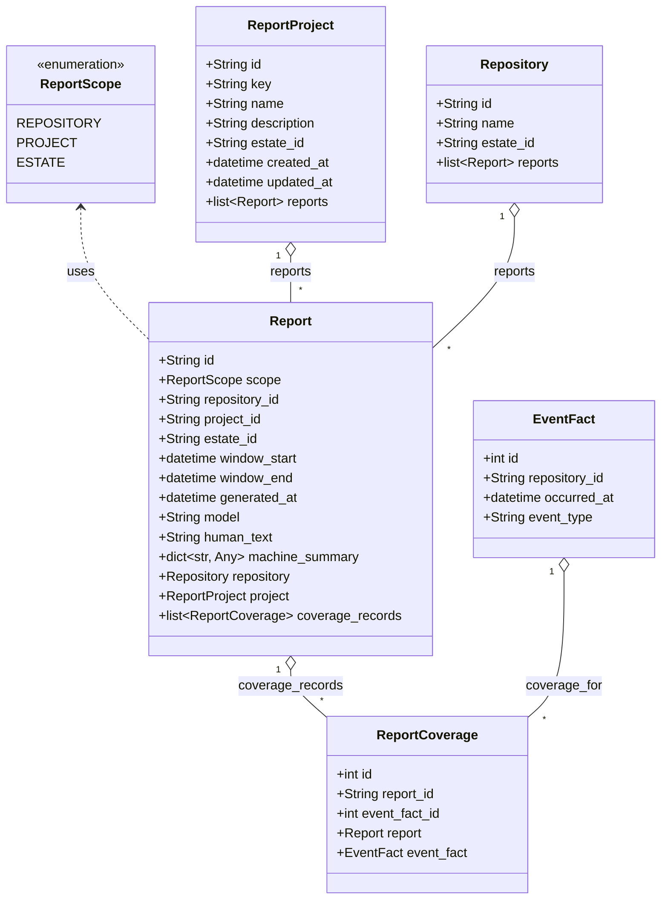

# Bronze and Silver Layer Design for Ghillie

This document presents a concrete design, anchored in the Medallion model from
the Ghillie docs and grounded in the named stack: Granian, async Falcon,
msgspec, Postgres, async SQLAlchemy 2.x, async Dramatiq, pytest, pytest-bdd.

Figure: Silver and Bronze class relationships for RawEvent transformation.

```mermaid
classDiagram
    class RawEvent {
        +int id
        +str source_system
        +str source_event_id
        +str event_type
        +str repo_external_id
        +datetime occurred_at
        +dict payload
    }

    class RawEventTransformError {
        +str reason
        +RawEventTransformError payload_mismatch()
        +RawEventTransformError concurrent_insert()
        +RawEventTransformError invalid_payload(message)
        +RawEventTransformError repository_mismatch()
        +RawEventTransformError entity_transform_failed(exc)
        +RawEventTransformError datetime_requires_timezone(field)
        +RawEventTransformError invalid_datetime_format(field)
        +RawEventTransformError missing_datetime_timezone(field)
        +RawEventTransformError unsupported_datetime_type(field)
    }

    class Repository {
        +str id
        +str estate_id
        +str github_owner
        +str github_name
        +str default_branch
        +bool is_active
        +datetime created_at
        +datetime updated_at
        +str catalogue_repository_id
        +bool ingestion_enabled
        +list~str~ documentation_paths
        +datetime last_synced_at
        +list~Commit~ commits
        +list~PullRequest~ pull_requests
        +list~Issue~ issues
        +list~DocumentationChange~ documentation_changes
    }

    class Commit {
        +str sha
        +str repo_id
        +str author_email
        +str author_name
        +datetime authored_at
        +datetime committed_at
        +str message
        +dict metadata_
        +datetime first_seen_at
        +Repository repository
        +list~DocumentationChange~ documentation_changes
    }

    class PullRequest {
        +int id
        +str repo_id
        +int number
        +str title
        +str author_login
        +str state
        +datetime merged_at
        +datetime closed_at
        +datetime created_at
        +list~str~ labels
        +bool is_draft
        +str base_branch
        +str head_branch
        +dict metadata_
        +Repository repository
    }

    class Issue {
        +int id
        +str repo_id
        +int number
        +str title
        +str author_login
        +str state
        +datetime created_at
        +datetime closed_at
        +list~str~ labels
        +dict metadata_
        +Repository repository
    }

    class DocumentationChange {
        +int id
        +str repo_id
        +str commit_sha
        +str path
        +str change_type
        +bool is_roadmap
        +bool is_adr
        +dict metadata_
        +datetime occurred_at
        +Repository repository
        +Commit commit
    }

    class EventFact {
        +int id
        +int raw_event_id
        +str repo_external_id
        +str event_type
        +datetime occurred_at
        +dict payload
    }

    class GithubCommitPayload {
        +str sha
        +str repo_owner
        +str repo_name
        +str message
        +str author_email
        +str author_name
        +str authored_at
        +str committed_at
        +str default_branch
        +dict metadata
    }

    class GithubPullRequestPayload {
        +int id
        +int number
        +str title
        +str state
        +str base_branch
        +str head_branch
        +str repo_owner
        +str repo_name
        +str created_at
        +str author_login
        +str merged_at
        +str closed_at
        +list~str~ labels
        +bool is_draft
        +dict metadata
    }

    class GithubIssuePayload {
        +int id
        +int number
        +str title
        +str state
        +str repo_owner
        +str repo_name
        +str created_at
        +str author_login
        +str closed_at
        +list~str~ labels
        +dict metadata
    }

    class GithubDocumentationChangePayload {
        +str commit_sha
        +str path
        +str change_type
        +str repo_owner
        +str repo_name
        +str occurred_at
        +bool is_roadmap
        +bool is_adr
        +dict metadata
    }

    class RawEventTransformer {
        -async _process_single_event(session, raw_event) int
        -async _upsert_event_fact(session, raw_event) void
        -async _apply_entity_transform(session, raw_event) void
        -async _handle_transform_error(session, raw_event, exc) int
        +async process_pending() void
    }

    class TransformersRegistry {
        -dict~str, EntityTransformer~ _registry
        +register(event_type) EntityTransformer
        +get_entity_transformer(event_type) EntityTransformer
    }

    class EntityTransformer {
        <<interface>>
        +async __call__(session, raw_event) void
    }

    class GithubCommitTransformer {
        +async transform_github_commit(session, raw_event) void
    }

    class GithubPullRequestTransformer {
        +async transform_github_pull_request(session, raw_event) void
    }

    class GithubIssueTransformer {
        +async transform_github_issue(session, raw_event) void
    }

    class GithubDocChangeTransformer {
        +async transform_github_doc_change(session, raw_event) void
    }

    RawEventTransformer --> EventFact : upserts
    RawEventTransformer --> RawEvent : consumes
    RawEventTransformer --> RawEventTransformError : raises
    RawEventTransformer --> TransformersRegistry : uses
    TransformersRegistry --> EntityTransformer : returns

    GithubCommitTransformer ..|> EntityTransformer
    GithubPullRequestTransformer ..|> EntityTransformer
    GithubIssueTransformer ..|> EntityTransformer
    GithubDocChangeTransformer ..|> EntityTransformer

    GithubCommitTransformer --> GithubCommitPayload
    GithubCommitTransformer --> Repository
    GithubCommitTransformer --> Commit

    GithubPullRequestTransformer --> GithubPullRequestPayload
    GithubPullRequestTransformer --> Repository
    GithubPullRequestTransformer --> PullRequest

    GithubIssueTransformer --> GithubIssuePayload
    GithubIssueTransformer --> Repository
    GithubIssueTransformer --> Issue

    GithubDocChangeTransformer --> GithubDocumentationChangePayload
    GithubDocChangeTransformer --> Repository
    GithubDocChangeTransformer --> DocumentationChange
    GithubDocChangeTransformer --> Commit

    Repository "1" o-- "*" Commit
    Repository "1" o-- "*" PullRequest
    Repository "1" o-- "*" Issue
    Repository "1" o-- "*" DocumentationChange
    Commit "1" o-- "*" DocumentationChange
```



______________________________________________________________________

## 1. Scope and goals

This design covers:

- the **Bronze layer**: raw, immutable event ingestion (“what happened,
  exactly?”), and
- the **Silver layer**: cleaned, deduplicated, relational state of the estate
  (“what is the current state and history?”),

implemented using:

- **Granian** + **async Falcon** – HTTP/API entrypoints for ingestion and admin,
- **msgspec** – fast, typed serialisation and validation of event payloads,
- **Postgres** – storage for Bronze (append-only) and Silver (relational),
- **async SQLAlchemy 2.x** – async ORM/SQL layer,
- **async Dramatiq** – background workers for Bronze→Silver transformation,
- **pytest** + **pytest-bdd** – tiered testing: unit, service, and
  scenario-level.

Gold/reporting and LLM bits sit above Silver and are out of scope here; the
point of this design is to give them a sane substrate.

______________________________________________________________________

## 2. High-level architecture

At a high level:

- **Bronze**:

- HTTP ingestion endpoints and scheduled pollers create **raw events**.
- Raw events are written to an append-only `raw_events` table.
- A Dramatiq task is enqueued for each new event, or per batch.
- **Silver**:

- Dramatiq workers consume Bronze events and apply **deterministic, idempotent
  transforms** into relational tables:

- `repositories`, `commits`, `pull_requests`, `issues`, `documentation_changes`,
- later, `violations`, `enrolments`, etc.
- Silver tables always represent the **current cleaned view**, but retain
  enough history for reports and metrics.

One way to picture it:



______________________________________________________________________

## 3. Database schemas

### 3.1 Bronze: `raw_events`

**Purpose:** preserve an immutable history of everything we saw from external
systems, with minimal assumptions, while giving the Silver layer enough hooks
to do its work efficiently.

**Recommended table:**

```sql
CREATE TABLE raw_events (
    id              BIGSERIAL PRIMARY KEY,
    source_system   TEXT NOT NULL,         -- 'github', 'concordat', etc.
    source_event_id TEXT,                  -- GitHub node ID, CloudEvents id, etc.
    event_type      TEXT NOT NULL,         -- 'github.commit', 'github.pull_request', etc.
    repo_external_id TEXT,                 -- e.g. "morganstanley/wildside-core"
    occurred_at     TIMESTAMPTZ NOT NULL,  -- from provider, if available
    ingested_at     TIMESTAMPTZ NOT NULL DEFAULT now(),
    dedupe_key      TEXT,                  -- stable hash of key fields
    payload         JSONB NOT NULL,        -- unmodified provider payload
    transform_state SMALLINT NOT NULL DEFAULT 0,
    -- 0 = pending, 1 = processed, 2 = failed (requires manual attention)
    transform_error TEXT
);

CREATE UNIQUE INDEX raw_events_dedupe_idx
    ON raw_events (source_system, dedupe_key);

CREATE INDEX raw_events_pending_idx
    ON raw_events (transform_state)
    WHERE transform_state = 0;

CREATE INDEX raw_events_repo_time_idx
    ON raw_events (repo_external_id, occurred_at);

```

Notes:

- `dedupe_key` is a **deterministic hash** over
  `(source_system, event_type, source_event_id)` or, when the provider does not
  give a stable id, a combination such as `(repo, occurred_at, SHA1(payload))`.
  This prevents duplicate Bronze events when webhooks retry or pollers overlap.
- `transform_state` lets the Silver workers pick up pending events efficiently
  without locking the entire table.
- No foreign keys: Bronze optimises for **write throughput** and
  **replayability**, not relational integrity.

You will also want a little side-table for **polling offsets**:

```sql
CREATE TABLE github_ingestion_offsets (
    id              BIGSERIAL PRIMARY KEY,
    repo_external_id TEXT NOT NULL UNIQUE,
    last_commit_cursor TEXT,
    last_issue_cursor  TEXT,
    last_pr_cursor     TEXT,
    updated_at         TIMESTAMPTZ NOT NULL DEFAULT now()
);

```

### 3.1.1 Implementation status (November 2025)

- `raw_events` is implemented in `ghillie.bronze.storage.RawEvent` with a
  hashed `dedupe_key` derived from source system, event type, source event id,
  repository slug, occurred timestamp (UTC), and a stable hash of the payload.
  `RawEventWriter.ingest` deep copies payloads, enforces timezone-aware
  `occurred_at`, and returns the existing row on conflicts to keep the store
  append-only.
- `github_ingestion_offsets` is present for pollers to record cursors, but it
  is not yet wired into a worker loop.
- A minimal Silver staging table, `event_facts`, reuses the Bronze declarative
  base. `RawEventTransformer` copies Bronze payloads into `event_facts`, marks
  `transform_state` as processed, and verifies on reprocessing that the stored
  payload matches. This satisfies the Task 1.2.a requirement that re-running
  transforms produces identical Silver outputs.

### 3.2 Silver: core tables

This deliberately mirrors the high-level design doc: the Silver layer manages
the estate inventory and event history in a relational form.

Minimal Silver schema for the Ghillie MVP:

```sql
CREATE TABLE repositories (
    id              UUID PRIMARY KEY DEFAULT gen_random_uuid(),
    estate_id       UUID,               -- nullable until estates are wired in
    github_owner    TEXT NOT NULL,
    github_name     TEXT NOT NULL,
    default_branch  TEXT NOT NULL,
    is_active       BOOLEAN NOT NULL DEFAULT TRUE,
    created_at      TIMESTAMPTZ NOT NULL DEFAULT now(),
    updated_at      TIMESTAMPTZ NOT NULL DEFAULT now(),
    UNIQUE (github_owner, github_name)
);

CREATE TABLE commits (
    sha             TEXT PRIMARY KEY,
    repo_id         UUID NOT NULL REFERENCES repositories(id),
    author_email    TEXT,
    author_name     TEXT,
    authored_at     TIMESTAMPTZ,
    committed_at    TIMESTAMPTZ,
    message         TEXT,
    metadata        JSONB NOT NULL DEFAULT '{}'::jsonb,
    first_seen_at   TIMESTAMPTZ NOT NULL DEFAULT now()
);

CREATE INDEX commits_repo_time_idx
    ON commits (repo_id, committed_at);

CREATE TABLE pull_requests (
    id                  BIGINT PRIMARY KEY,  -- GitHub numeric ID or node id hash
    repo_id             UUID NOT NULL REFERENCES repositories(id),
    number              INTEGER NOT NULL,
    title               TEXT NOT NULL,
    author_login        TEXT,
    state               TEXT NOT NULL,      -- 'open', 'closed', 'merged'
    merged_at           TIMESTAMPTZ,
    closed_at           TIMESTAMPTZ,
    created_at          TIMESTAMPTZ NOT NULL,
    labels              TEXT[] NOT NULL DEFAULT '{}',
    is_draft            BOOLEAN NOT NULL DEFAULT FALSE,
    base_branch         TEXT NOT NULL,
    head_branch         TEXT NOT NULL,
    metadata            JSONB NOT NULL DEFAULT '{}'::jsonb,
    UNIQUE (repo_id, number)
);

CREATE TABLE issues (
    id                  BIGINT PRIMARY KEY,
    repo_id             UUID NOT NULL REFERENCES repositories(id),
    number              INTEGER NOT NULL,
    title               TEXT NOT NULL,
    author_login        TEXT,
    state               TEXT NOT NULL,      -- 'open', 'closed'
    created_at          TIMESTAMPTZ NOT NULL,
    closed_at           TIMESTAMPTZ,
    labels              TEXT[] NOT NULL DEFAULT '{}',
    metadata            JSONB NOT NULL DEFAULT '{}'::jsonb,
    UNIQUE (repo_id, number)
);

CREATE TABLE documentation_changes (
    id              BIGSERIAL PRIMARY KEY,
    repo_id         UUID NOT NULL REFERENCES repositories(id),
    commit_sha      TEXT NOT NULL REFERENCES commits(sha),
    path            TEXT NOT NULL,
    change_type     TEXT NOT NULL,          -- 'added', 'modified', 'deleted'
    is_roadmap      BOOLEAN NOT NULL DEFAULT FALSE,
    is_adr          BOOLEAN NOT NULL DEFAULT FALSE,
    metadata        JSONB NOT NULL DEFAULT '{}'::jsonb,
    occurred_at     TIMESTAMPTZ NOT NULL
);

CREATE INDEX documentation_changes_repo_time_idx
    ON documentation_changes (repo_id, occurred_at);

```

If you want a **Silver-level event fact** table for generic queries, add:

```sql
CREATE TABLE event_facts (
    id              BIGSERIAL PRIMARY KEY,
    raw_event_id    BIGINT NOT NULL REFERENCES raw_events(id),
    repo_id         UUID REFERENCES repositories(id),
    event_type      TEXT NOT NULL,
    occurred_at     TIMESTAMPTZ NOT NULL,
    payload         JSONB NOT NULL
);

```

This gives you a structured, queryable linkage from Bronze to Silver without
forcing every consumer to understand all the entity tables.

### 3.2.1 Implementation status (December 2025)

- SQLAlchemy models now cover `repositories`, `commits`, `pull_requests`,
  `issues`, and `documentation_changes`, using JSON columns for metadata and
  uniqueness on `(repo_id, number)` for PRs/issues and
  `(repo_id, commit_sha, path)` for documentation changes.
- `RawEventTransformer` routes `github.commit`, `github.pull_request`,
  `github.issue`, and `github.doc_change` events through msgspec-validated
  structs before upserting Silver rows. Repository rows are auto-created with a
  default branch of `main` when absent, and updated if a payload provides a new
  default.
- Documentation changes deduplicate on commit + path and create a lightweight
  commit stub when a doc change arrives before its commit record.
- EventFact staging remains in place and is written in the same transaction as
  entity rows, so replaying raw events keeps foreign keys consistent while
  preserving deterministic payload checks.

______________________________________________________________________

## 4. Python package layout

One workable layout:

```text
ghillie/
  bronze/
    api/                     # HTTP ingestion
      __init__.py
      app.py                 # Falcon app
      resources.py           # Falcon resources
      schemas.py             # msgspec structs for inbound events
    workers/
      __init__.py
      github_poller.py       # Dramatiq actor
      concordat_receiver.py  # HTTP → raw_events, or CloudEvents helper
    models.py                # SQLAlchemy models for raw_events, offsets
    services.py              # functions for writing raw_events
  silver/
    models.py                # SQLAlchemy models for repositories, commits, etc.
    transformers/
      __init__.py
      base.py                # common transform utilities
      github_commits.py
      github_pull_requests.py
      github_issues.py
      github_docs.py
      concordat_violations.py
    workers.py               # Dramatiq actors to run transforms
  db/
    base.py                  # async engine/session management
  tests/
    unit/
    service/
    bdd/
      features/
      steps/

```

This keeps Bronze concerns (raw ingestion) separated from Silver concerns
(stateful transforms), while allowing shared db infrastructure.

______________________________________________________________________

## 5. Bronze layer design

### 5.1 Ingestion service (Granian + async Falcon + msgspec)

**Granian** runs the ASGI app; **Falcon** provides routing and error handling.

`ghillie/bronze/api/app.py`:

```python
import falcon.asgi
from .resources import ConcordatEventResource

def create_app() -> falcon.asgi.App:
    app = falcon.asgi.App()
    app.add_route("/ingest/concordat", ConcordatEventResource())
    # more endpoints as needed
    return app

```

A simple Concordat CloudEvents resource:

```python
import falcon
import msgspec
from datetime import datetime, timezone

from ..services import persist_raw_event

class CloudEvent(msgspec.Struct):
    id: str
    source: str
    type: str
    subject: str | None = None
    time: datetime
    data: dict

class ConcordatEventResource:
    async def on_post(self, req: falcon.Request, resp: falcon.Response) -> None:
        body = await req.get_media()  # bytes or dict depending on config
        try:
            event = msgspec.json.decode(body, type=CloudEvent)
        except msgspec.ValidationError as e:
            raise falcon.HTTPBadRequest("Invalid event", str(e))

        # infer repo from subject or data, depending on Concordat contract
        repo_external_id = event.subject  # placeholder

        await persist_raw_event(
            source_system="concordat",
            source_event_id=event.id,
            event_type=event.type,  # e.g. "compliance.violation.created"
            repo_external_id=repo_external_id,
            occurred_at=event.time.astimezone(timezone.utc),
            payload=msgspec.to_builtins(event),
        )

        resp.status = falcon.HTTP_202

```

`persist_raw_event` handles dedupe and enqueues transform work.

### 5.2 GitHub ingestion worker (async Dramatiq)

GitHub ingestion is **poll-based**, not webhook-based, to keep control over
rate limits and estate scoping.

A Dramatiq actor (synchronous wrapper around async code):

```python
import asyncio
import dramatiq
from github import GitHubClient  # project client using httpx/GraphQL

from .services import persist_raw_event
from ..db.base import get_async_session

@dramatiq.actor
def ingest_github_repo(repo_external_id: str) -> None:
    asyncio.run(_ingest_github_repo_async(repo_external_id))

async def _ingest_github_repo_async(repo_external_id: str) -> None:
    async with get_async_session() as session:
        client = GitHubClient()  # injected config, bearer token, etc.
        offsets = await load_offsets(session, repo_external_id)

        async for commit in client.iter_commits(repo_external_id, since_cursor=offsets.last_commit_cursor):
            await persist_raw_event(
                source_system="github",
                source_event_id=commit.node_id,
                event_type="github.commit",
                repo_external_id=repo_external_id,
                occurred_at=commit.committed_at,
                payload=commit.raw_payload,  # dict
            )

        # similar loops for PRs, issues, docs
        await update_offsets(session, repo_external_id, new_offsets)

```

Schedule `ingest_github_repo` via cron, another orchestrator, or a simple
periodic loop actor.

### 5.3 Bronze persistence service

`ghillie/bronze/services.py`:

```python
import hashlib
from datetime import datetime
from typing import Any

from sqlalchemy import insert, select
from sqlalchemy.exc import IntegrityError
from sqlalchemy.ext.asyncio import AsyncSession

from ..db.base import get_async_session
from .models import RawEvent
from ..silver.workers import enqueue_transform_batch  # see later

def _make_dedupe_key(
    source_system: str,
    event_type: str,
    source_event_id: str | None,
    repo_external_id: str | None,
    occurred_at: datetime,
    payload: dict[str, Any],
) -> str:
    # fall back to hashing payload+time when source_event_id is missing
    material = f"{source_system}|{event_type}|{source_event_id or ''}|{repo_external_id or ''}|{occurred_at.isoformat()}".encode()
    # in extremis you can also add SHA1(json.dumps(payload, sort_keys=True))
    return hashlib.sha256(material).hexdigest()

async def persist_raw_event(
    source_system: str,
    source_event_id: str | None,
    event_type: str,
    repo_external_id: str | None,
    occurred_at: datetime,
    payload: dict[str, Any],
) -> int:
    dedupe_key = _make_dedupe_key(
        source_system, event_type, source_event_id, repo_external_id, occurred_at, payload
    )

    async with get_async_session() as session:
        stmt = insert(RawEvent).values(
            source_system=source_system,
            source_event_id=source_event_id,
            event_type=event_type,
            repo_external_id=repo_external_id,
            occurred_at=occurred_at,
            dedupe_key=dedupe_key,
            payload=payload,
        ).returning(RawEvent.id)

        try:
            result = await session.execute(stmt)
            raw_event_id = result.scalar_one()
            await session.commit()
        except IntegrityError:
            # already ingested
            await session.rollback()
            # load existing id for logging / idempotency
            existing_stmt = select(RawEvent.id).where(
                RawEvent.source_system == source_system,
                RawEvent.dedupe_key == dedupe_key,
            )
            res = await session.execute(existing_stmt)
            raw_event_id = res.scalar_one()
            return raw_event_id

    # enqueue transform work
    enqueue_transform_batch.send([raw_event_id])
    return raw_event_id

```

This function enforces idempotent Bronze ingestion and hides SQLAlchemy details
from callers.

______________________________________________________________________

## 6. Silver layer design

### 6.1 SQLAlchemy models (async 2.x style)

`ghillie/silver/models.py`:

```python
from sqlalchemy.orm import Mapped, mapped_column, relationship, DeclarativeBase
from sqlalchemy import ForeignKey, ARRAY, JSON
from datetime import datetime
from uuid import uuid4

class Base(DeclarativeBase):
    pass

class Repository(Base):
    __tablename__ = "repositories"

    id: Mapped[str] = mapped_column(primary_key=True, default=lambda: str(uuid4()))
    github_owner: Mapped[str]
    github_name: Mapped[str]
    default_branch: Mapped[str]
    is_active: Mapped[bool] = mapped_column(default=True)
    created_at: Mapped[datetime]
    updated_at: Mapped[datetime]

    commits: Mapped[list["Commit"]] = relationship(back_populates="repo")

class Commit(Base):
    __tablename__ = "commits"

    sha: Mapped[str] = mapped_column(primary_key=True)
    repo_id: Mapped[str] = mapped_column(ForeignKey("repositories.id"))
    author_email: Mapped[str | None]
    author_name: Mapped[str | None]
    authored_at: Mapped[datetime | None]
    committed_at: Mapped[datetime | None]
    message: Mapped[str | None]
    metadata: Mapped[dict] = mapped_column(JSON, default=dict)
    first_seen_at: Mapped[datetime]

    repo: Mapped[Repository] = relationship(back_populates="commits")

# Similar for PullRequest, Issue, DocumentationChange

```

Use separate `Base` classes for Bronze and Silver if you want to keep them
physically separated (`bronze.models.Base`, `silver.models.Base`), but sharing
an engine is fine.

### 6.2 Event routing and transformation

The fundamental pattern: map each `raw_events.event_type` to a **transformer**
function that:

- loads the Bronze payload,
- performs **pure, deterministic mapping** (preferably into msgspec structs),
- applies idempotent upserts into Silver tables.

#### 6.2.1 Transformer registry

`ghillie/silver/transformers/base.py`:

```python
from collections.abc import Callable
from typing import Awaitable
from sqlalchemy.ext.asyncio import AsyncSession

from ...bronze.models import RawEvent

Transformer = Callable[[AsyncSession, RawEvent], Awaitable[None]]

_registry: dict[str, Transformer] = {}

def register(event_type: str):
    def _inner(func: Transformer) -> Transformer:
        _registry[event_type] = func
        return func
    return _inner

def get_transformer(event_type: str) -> Transformer | None:
    return _registry.get(event_type)

```

#### 6.2.2 GitHub commit transformer (example)

`ghillie/silver/transformers/github_commits.py`:

```python
import msgspec
from datetime import datetime
from sqlalchemy import select

from .base import register
from ..models import Repository, Commit
from ...bronze.models import RawEvent

class GitHubCommitPayload(msgspec.Struct):
    sha: str
    message: str
    authored_date: datetime | None = None
    committed_date: datetime | None = None
    author_email: str | None = None
    author_name: str | None = None
    repo_owner: str
    repo_name: str
    # ... add any fields you care about

@register("github.commit")
async def transform_github_commit(session: AsyncSession, raw: RawEvent) -> None:
    payload = msgspec.convert(raw.payload, GitHubCommitPayload)

    # Ensure repo exists
    stmt = select(Repository).where(
        Repository.github_owner == payload.repo_owner,
        Repository.github_name == payload.repo_name,
    )
    result = await session.execute(stmt)
    repo = result.scalar_one_or_none()

    if repo is None:
        repo = Repository(
            github_owner=payload.repo_owner,
            github_name=payload.repo_name,
            default_branch="main",  # can be overwritten later
        )
        session.add(repo)
        await session.flush()  # populate repo.id

    # Upsert commit (idempotent)
    existing = await session.get(Commit, payload.sha)
    if existing is None:
        commit = Commit(
            sha=payload.sha,
            repo_id=repo.id,
            author_email=payload.author_email,
            author_name=payload.author_name,
            authored_at=payload.authored_date,
            committed_at=payload.committed_date,
            message=payload.message,
            metadata={},  # fill as needed
        )
        session.add(commit)
    else:
        # Optionally update metadata fields if they can change
        pass

```

Use similar transformers for:

- `"github.pull_request"` → `PullRequest` table (plus maybe `event_facts` rows).
- `"github.issue"` → `Issue`.
- `"github.doc_change"` → `DocumentationChange`.

This keeps Bronze payloads flexible while forcing Silver into sane types.

### 6.3 Transform worker (async Dramatiq)

`ghillie/silver/workers.py`:

```python
import asyncio
from typing import Sequence

import dramatiq
from sqlalchemy import select
from sqlalchemy.ext.asyncio import AsyncSession

from ..db.base import get_async_session
from ..bronze.models import RawEvent
from .transformers.base import get_transformer

@dramatiq.actor
def enqueue_transform_batch(raw_event_ids: list[int]) -> None:
    # Fire-and-forget actor that kicks off async work
    asyncio.run(_transform_events(raw_event_ids))

async def _transform_events(raw_event_ids: Sequence[int]) -> None:
    async with get_async_session() as session:  # type: AsyncSession
        stmt = select(RawEvent).where(RawEvent.id.in_(raw_event_ids))
        res = await session.execute(stmt)
        events = list(res.scalars())

        for raw in events:
            transformer = get_transformer(raw.event_type)
            if not transformer:
                # log and skip
                continue

            try:
                await transformer(session, raw)
                raw.transform_state = 1
                raw.transform_error = None
            except Exception as e:
                raw.transform_state = 2
                raw.transform_error = str(e)

        await session.commit()

```

For large backfills, you probably want a **pull-based transform** as well:

- a periodic actor that selects pending events (`transform_state = 0`) in
  batches and passes them into `_transform_events`.

This helps when Bronze ingestion is bulk-loaded, rather than one-at-a-time via
`persist_raw_event`.

______________________________________________________________________

## 7. msgspec schemas and event normalisation

You will have three levels of structure:

1. **Provider payloads** – whatever GitHub/Concordat send. These live as plain
   `dict[str, Any]` in `raw_events.payload`.
2. **Bronze-normalised structs** – minimal `msgspec.Struct` types that adapt
   provider differences but still reflect “event-level” granularity.
3. **Silver entities** – ORM tables representing long-lived objects.

Example for a pull request:

```python
class GitHubPullRequestEvent(msgspec.Struct):
    id: int
    number: int
    title: str
    state: str
    is_draft: bool
    created_at: datetime
    merged_at: datetime | None = None
    closed_at: datetime | None = None
    labels: list[str] = []
    base_branch: str
    head_branch: str
    repo_owner: str
    repo_name: str
    author_login: str | None = None

```

In Bronze, you do:

```python
payload = GitHubPullRequestEvent(...from GraphQL response...)
await persist_raw_event(
    source_system="github",
    source_event_id=str(payload.id),
    event_type="github.pull_request",
    repo_external_id=f"{payload.repo_owner}/{payload.repo_name}",
    occurred_at=payload.created_at,
    payload=msgspec.to_builtins(payload),
)

```

In Silver, you use `msgspec.convert(raw.payload, GitHubPullRequestEvent)` to
reconstruct the typed struct and map it to `PullRequest` rows.

This gives you:

- strong typing in transform code,
- stable Bronze storage (just JSONB),
- easy schema evolution: when you add fields to `GitHubPullRequestEvent`, old
  events continue to decode, as long as you mark new fields optional or with
  defaults.

______________________________________________________________________

## 8. Tiered testing strategy

### 8.1 Unit tests (pytest)

Scope:

- Pure functions: dedupe key generation, offset management, mapping logic
  (msgspec struct → ORM object).
- Transformers with **fake sessions** or small in-memory dbs.

Example: test the commit transformer with a stub session:

```python
@pytest.mark.asyncio
async def test_transform_github_commit_creates_repo_and_commit(async_session):
    raw = RawEvent(
        id=1,
        source_system="github",
        event_type="github.commit",
        payload={
            "sha": "abc123",
            "message": "Initial commit",
            "repo_owner": "org",
            "repo_name": "repo",
            # ...
        },
        occurred_at=datetime.now(timezone.utc),
    )

    await transform_github_commit(async_session, raw)

    repo = await async_session.scalar(
        select(Repository).where(Repository.github_owner == "org", Repository.github_name == "repo")
    )
    assert repo is not None

    commit = await async_session.get(Commit, "abc123")
    assert commit is not None
    assert commit.repo_id == repo.id

```

Here `async_session` is a fixture that creates an ephemeral Postgres schema (or
uses SQLite in memory if you’re happy with the limitations).

### 8.2 Service / component tests

Scope:

- The **Bronze API** endpoints using Falcon’s ASGI test client.
- The `persist_raw_event` function behaviour against a real database.

Example (Falcon test):

```python
import pytest
from falcon import testing
from datetime import datetime, timezone
import msgspec

from ghillie.bronze.api.app import create_app
from ghillie.bronze.models import RawEvent

@pytest.mark.asyncio
async def test_concordat_ingestion_creates_raw_event(async_session, db_engine):
    app = create_app()
    client = testing.TestClient(app)

    event = CloudEvent(
        id="evt-1",
        source="concordat",
        type="compliance.violation.created",
        subject="org/repo",
        time=datetime.now(timezone.utc),
        data={"violation": "missing-docs"},
    )
    body = msgspec.json.encode(event)

    resp = client.simulate_post("/ingest/concordat", body=body)
    assert resp.status_code == 202

    # Check DB
    result = await async_session.execute(select(RawEvent))
    rows = result.scalars().all()
    assert len(rows) == 1
    assert rows[0].source_system == "concordat"

```

### 8.3 Scenario / BDD tests (pytest-bdd)

Scope:

- Cross-layer behaviours: “Bronze→Silver pipeline produces correct state”.

Write a `.feature` file:

```gherkin
Feature: GitHub commit ingestion

  Scenario: A new commit appears on GitHub
    Given a repository "org/repo" exists in GitHub
    And the Bronze layer is empty
    When the GitHub poller ingests commits for "org/repo"
    And the Silver transformer processes pending events
    Then the Silver layer contains a commit "abc123" for "org/repo"
    And the commit is linked to the repository

```

Step definitions wire directly onto your code:

```python
from pytest_bdd import given, when, then, scenarios

scenarios("github_commit_ingestion.feature")

@given('the Bronze layer is empty')
async def empty_bronze(async_session):
    await async_session.execute(text("TRUNCATE raw_events CASCADE"))

@when('the GitHub poller ingests commits for "org/repo"')
def run_poller(mocker):
    # mock GitHubClient.iter_commits to yield a known commit struct
    ...

@when('the Silver transformer processes pending events')
def process_pending_events():
    process_pending_events_actor.send()  # Dramatiq actor running _transform_events batch

@then('the Silver layer contains a commit "abc123" for "org/repo"')
async def assert_commit(async_session):
    result = await async_session.execute(
        select(Commit).join(Repository).where(
            Commit.sha == "abc123",
            Repository.github_owner == "org",
            Repository.github_name == "repo",
        )
    )
    commit = result.scalar_one()
    assert commit is not None

```

The BDD layer is where you exercise the **whole data path** end-to-end, and
explicitly encode behaviours like idempotency and error handling.

______________________________________________________________________

## 9. Error handling and observability

A few practical constraints you’ll want to bake into the design up front:

- **Idempotency:** every transformer must be safe to run many times over the
  same events. Use primary keys anchored in provider ids (`sha`, PR number +
  repo, GitHub node id) and “upsert, don’t insert blindly”.
- **Reprocessing:** you can safely re-run transformations over a time window by:

- setting `transform_state` back to `0` for selected events, and
- invoking the transform worker over those event ids.
- **Telemetry:**

- Bronze: log ingestion failures, event sizes, and dedupe rates.
- Silver: log transform failures per event type, and maintain a simple
  `transform_failures` dashboard.
- **Timezone discipline and payload safety:** ingestion and hashing enforce
  timezone-aware datetimes. Naive values raise `TimezoneAwareRequiredError`,
  payload datetimes are normalised to UTC ISO strings before persistence, and
  unsupported payload types raise `UnsupportedPayloadTypeError` to keep dedupe
  hashes deterministic and JSON-serializable.
- **Concurrent transforms:** Silver transforms treat uniqueness races as
  benign. If an `IntegrityError` occurs because another worker already inserted
  an `event_facts` row, the late worker re-reads the row and marks the
  `raw_event` as processed instead of failing.
- **Back-pressure:** if Silver can’t keep up, you can:

- slow down pollers (GitHub),
- disable ingestion for some repos,
- or scale Dramatiq workers horizontally.

### 9.1 Catalogue importer and reconciliation (Phase 1.1.b)

The catalogue importer materializes the YAML catalogue into `estates`,
`projects`, `components`, `component_edges`, and `repositories`. It runs inside
one transaction per commit, so validation errors roll back cleanly. Imports are
idempotent: projects/components/repos are upserted by key, missing entries are
pruned, and component edges are rebuilt from the catalogue graph each run.
Processed commits are recorded in `catalogue_imports` for audit purposes, while
allowing replays when operators want to reassert catalogue truth. A Dramatiq
actor (`import_catalogue_job`) executes the importer asynchronously, and a
`GitCatalogueWatcher` polls `git rev-parse` to enqueue new imports whenever the
catalogue repository's HEAD moves.

### 9.2 Repository discovery and registration (Phase 1.3.a)

The `RepositoryRegistryService` bridges the catalogue domain with the Silver
layer by synchronizing catalogue repositories into the Silver `repositories`
table. This enables controlled GitHub ingestion with per-repository toggle
controls.

**Silver Repository extensions:**

- `catalogue_repository_id`: links to the source catalogue `RepositoryRecord.id`
- `ingestion_enabled`: controls whether the ingestion worker processes this
  repository (default `True` for catalogue repos, `False` for ad hoc)
- `documentation_paths`: copied from catalogue for doc change detection
- `last_synced_at`: audit timestamp for sync freshness

**Sync behaviour:**

1. Load catalogue `RepositoryRecord` entries for an estate via component
   definitions.
2. Match Silver repositories by slug (`owner/name`).
3. Upsert: create new Silver rows or update existing ones with catalogue
   metadata.
4. Deactivate: repositories removed from catalogue have `ingestion_enabled` set
   to `False` (soft disable, no deletion).
5. Ad-hoc repositories created by the Silver transformer default to
   `ingestion_enabled=False` to prevent uncontrolled event processing.

**Usage:**

```python
from ghillie.registry import RepositoryRegistryService

service = RepositoryRegistryService(catalogue_session_factory, silver_session_factory)
result = await service.sync_from_catalogue("wildside")

# Toggle ingestion
await service.disable_ingestion("leynos", "wildside-engine")
await service.enable_ingestion("leynos", "wildside-engine")

# List active repositories for ingestion worker
repos = await service.list_active_repositories()
```

______________________________________________________________________

## 10. How this ties back to the roadmap

This design provides concrete implementations for:

- **Task 1.2.a – Bronze raw event store**: `raw_events` schema,
  `github_ingestion_offsets`, `persist_raw_event`.
- **Task 1.2.b – Silver entity tables**: `repositories`, `commits`,
  `pull_requests`, `issues`, `documentation_changes`, plus transformers.
- **Task 1.2.c – Gold report metadata schema**: `reports`, `report_projects`,
  and `report_coverage` tables with scope-aware constraints.
- **Task 1.3 – GitHub ingestion service**: Granian/Falcon API (for Concordat),
  async Dramatiq pollers for GitHub.
- **Task 4.1 – Concordat CloudEvents ingestion**: `CloudEvent` msgspec struct
  and `/ingest/concordat` endpoint.

### 10.1 Gold report metadata schema (Phase 1.2.c)

The Gold layer now persists report metadata separately from event ingestion:

- `reports` captures scope (`repository`, `project`, `estate`), reporting
  window, generator (`model`), rendered text, and a machine-readable summary
  payload. Window bounds are constrained to enforce `window_end > window_start`
  and repository/project scopes must include the corresponding identifiers.
- `report_projects` is a lightweight dimension keyed by `key` and `id` so
  project-scoped reports do not depend on the catalogue database (which uses a
  conflicting `repositories` schema). An optional `estate_id` keeps alignment
  with repository rows that already carry `estate_id`.
- `report_coverage` maps reports to `event_facts` rather than `raw_events`.
  Using Silver’s deterministic event ids keeps replay idempotent even if Bronze
  payload dedupe rules evolve.

With Bronze, Silver, and the Gold metadata tables in place, the remaining
Gold/reporting work centres on querying Silver for reporting windows, building
evidence bundles, and invoking the status model.

Figure 10.1: Gold layer report metadata relationships.


