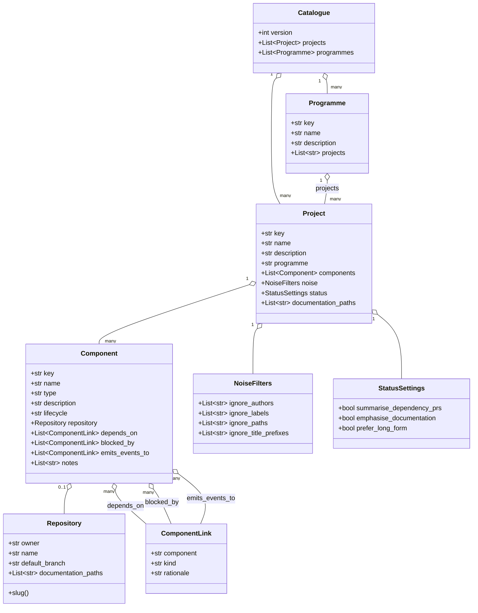

# Ghillie: High-Fidelity Architectural Specification for Intelligent Estate Status Reporting and Governance Integration

## 1. Strategic Context and Architectural Vision

In the contemporary landscape of software engineering, the management of
large-scale technical estates has transitioned from a static inventory problem
to a dynamic intelligence challenge. Organizations no longer struggle merely to
list their repositories; rather, the difficulty lies in synthesizing the
velocity, health, and compliance posture of thousands of disparate software
assets into a coherent narrative. This document outlines the comprehensive
architectural design for **Ghillie**, a system engineered to provide automated,
intelligent status updates on GitHub estates.

Critically, this design operates in tandem with **Concordat**, a distinct but
highly integrated system responsible for the enforcement of governance
standards. While Concordat acts as the active control plane—driving enrolment,
detecting violations, and enforcing policies—Ghillie serves as the
observational data plane. It aggregates signals of engineering activity
(commits, pull requests, roadmap updates) and compliance status (violations,
enrolment events) to produce high-fidelity, human-readable reports. The synergy
between these systems relies on a clear separation of concerns: Concordat
enforces, while Ghillie observes and narrates.

The architectural philosophy underpinning Ghillie is derived from the
**Medallion Architecture** pattern commonly found in modern data lakehouses.1
This pattern dictates a progressive refinement of data—from raw ingestion
(Bronze), to cleaned and enriched structures (Silver), and finally to
aggregated business-level intelligence (Gold). By adopting this structure,
Ghillie ensures that the final status reports presented to engineering
leadership are traceable back to immutable source events, providing the
auditability required in regulated industries. Furthermore, the system
leverages the emergent capabilities of **Large Language Models (LLMs)** to
perform hierarchical summarization, transforming the granular noise of git logs
into strategic insights.2

This specification is targeted at senior implementors and system architects. It
details the data flows, schema designs, API surfaces, and integration patterns
necessary to construct Ghillie as a scalable, production-grade platform.

## 2. The Medallion Data Architecture

The core of Ghillie’s data processing strategy is the Medallion Architecture.
This design pattern serves as the backbone for organizing data quality and
state transitions, ensuring that the system can handle the high velocity of
engineering data while maintaining the structural integrity required for
accurate reporting.

### 2.1 Bronze Layer: Raw Ingestion and Immutable History

The Bronze layer acts as the landing zone for all external signals entering the
Ghillie ecosystem. In a distributed software estate, data arrives in various
formats and velocities—bursty webhooks from GitHub during CI/CD storms,
periodic compliance snapshots from Concordat, and asynchronous roadmap updates.
The primary design constraint for the Bronze layer is write throughput and data
fidelity.

All incoming data is stored in its native, raw format. For GitHub webhooks,
this means capturing the full JSON payload of `push`, `pull_request`, and
`issue` events.4 For Concordat events, the system ingests **CloudEvents**
compliant messages without attempting immediate validation or transformation.5
This “store first, process later” approach decouples the ingestion
infrastructure from the complex business logic of the processing pipeline,
ensuring that no data is lost due to processing errors or schema mismatches.

The Bronze layer facilitates a crucial capability: **replayability**. As
governance rules evolve—a concept central to **Governance as Code** 7—it may
become necessary to re-evaluate historical data against new policies. By
retaining the raw inputs, Ghillie allows for the reprocessing of historical
events to generate retroactive insights or correct reporting errors without
needing to re-fetch data from upstream providers, which may be rate-limited or
ephemeral.

### 2.2 Silver Layer: Refined Inventory and Enriched State

Data moving from Bronze to Silver undergoes cleaning, deduplication, and
normalization. This layer represents the “Source of Truth” for the current
state of the estate.

In the context of Ghillie, the Silver layer is where the raw stream of events
is reconciled into a coherent entity model. GitHub commits are linked to
specific repositories and authors; raw compliance violation events are
associated with persistent team identities. This reconciliation process tackles
the challenge of **schema drift** and data consistency.8 For instance, a
repository might be renamed or transferred between organizations; the Silver
layer tracks these lifecycle events to maintain a stable identifier for the
asset, ensuring that historical status reports remain accessible even as the
underlying metadata changes.

The Silver layer also manages the integration of disparate data sources. It
joins the engineering velocity data (derived from GitHub) with the compliance
health data (ingested from Concordat). This join is critical for the “Ghillie”
value proposition: a status report that does not just list what was built, but
also qualifies _how_ it was built in the context of organizational standards.
The use of **PostgreSQL** with **JSONB** columns is recommended here to balance
the relational rigidity of entity mapping (Teams to Repositories) with the
flexibility required to store diverse compliance violation payloads.9

### 2.3 Gold Layer: Aggregated Intelligence and Reporting

The Gold layer is the consumption-ready tier, optimized for read-heavy
operations and analytics. Here, the granular data from the Silver layer is
aggregated into high-level metrics and narrative summaries.

This layer houses the final **Status Reports**. These are not simple data dumps
but synthesized documents generated by the Intelligence Engine. They contain
calculated **DORA metrics** (Deployment Frequency, Lead Time for Changes)
alongside the LLM-generated qualitative summaries.11 The data in the Gold layer
is structured to support immediate rendering by frontend applications,
specifically the **Backstage** developer portal plugin.13 Querying the Gold
layer should require zero computation; the heavy lifting of summarization and
metric calculation is performed upstream during the Silver-to-Gold transition.

By strictly adhering to this three-tier architecture, Ghillie avoids the common
pitfall of “spaghetti code” in data pipelines, where transformation logic is
scattered across the application. Instead, data flows logically from raw chaos
(Bronze) to structured order (Gold), enabling robust governance and
observability throughout the reporting lifecycle.

## 3. Ingestion Gateway: The Observer Pattern

The Ingestion Gateway is the sensory organ of Ghillie. It is responsible for
the reliable collection of signals from the external environment. Given the
scale of modern software estates, which may generate thousands of events per
minute, the gateway must be designed for high availability and asynchronous
processing.

### 3.1 Webhook Reception and Verification

The primary mechanism for real-time data acquisition is the webhook. Ghillie
exposes a secure HTTP endpoint to receive POST requests from GitHub and
Concordat. This component, ideally implemented in a high-concurrency language
like Go or Python with an async framework (e.g., FastAPI or Flask with Celery)
4, must perform minimal processing to minimize latency.

Upon receiving a request, the gateway’s first responsibility is security. It
must verify the cryptographic signature of the payload—such as the
`X-Hub-Signature-256` header provided by GitHub—to ensure the data originates
from a trusted source.4 This prevents spoofing attacks where malicious actors
might attempt to inject false status updates or compliance violations. Failed
verifications are logged as security incidents, but the payload is discarded
immediately to protect the downstream Bronze layer.

### 3.2 Asynchronous Event Buffering

To handle the “bursty” nature of engineering events—such as a mass-merge of
pull requests on a Friday afternoon or a scheduled compliance scan triggered by
Concordat—the gateway utilizes an **Event Buffer**. This is typically
implemented using a durable message queue like **Apache Kafka** or **AWS
SQS**.16

The gateway writes the verified raw payload to the buffer and immediately
acknowledges the HTTP request with a `202 Accepted` status. This asynchronous
pattern decouples the ingestion rate from the processing rate. It ensures that
a spike in traffic does not overwhelm the complex processing logic of the
Silver layer or the computationally expensive LLM operations in the
Intelligence Engine. This design aligns with the **Circuit Breaker** and
**Buffer** patterns found in resilient distributed systems 17, protecting
Ghillie from cascading failures during peak load.

### 3.3 Integration with Concordat via CloudEvents

Ghillie’s integration with Concordat is architected around the **CloudEvents
v1.0 specification**.5 This standard defines a common envelope for event data,
allowing Ghillie to consume governance signals without intimate knowledge of
Concordat’s internal logic.

Concordat acts as the event producer, emitting signals when specific lifecycle
changes occur. The two primary event types Ghillie listens for are
**Enrolment** and **Violation**. By standardizing on CloudEvents, the system
achieves loose coupling. If Concordat updates its internal policy
engine—switching, for example, from OPA (Open Policy Agent) to a custom rule
evaluator—the structure of the emitted event remains consistent, and Ghillie’s
ingestion logic requires no modification.18

#### Table 1: CloudEvents Integration Schema

| **Attribute**     | **Description**                           | **Example Value**                                | **Requirement** |
| ----------------- | ----------------------------------------- | ------------------------------------------------ | --------------- |
| `specversion`     | The version of the CloudEvents spec.      | `1.0`                                            | Mandatory 5     |
| `type`            | The specific governance event type.       | `concordat.compliance.violation`                 | Mandatory       |
| `source`          | The URI of the Concordat policy engine.   | `/concordat/policies/security`                   | Mandatory       |
| `subject`         | The identifier of the affected asset.     | `github.com/acme/payment-gateway`                | Mandatory       |
| `time`            | Timestamp of the detection.               | `2023-11-01T14:30:00Z`                           | Mandatory       |
| `datacontenttype` | Format of the payload.                    | `application/json`                               | Mandatory       |
| `data`            | The payload containing violation details. | `{ "severity": "HIGH", "rule": "no-public-s3" }` | Mandatory 19    |

This schema ensures that every piece of compliance data entering Ghillie
carries sufficient context (time, source, subject) to be routed and processed
correctly, regardless of the underlying compliance check that generated it.

### 3.4 Estate catalogue constraints (Phase 1.1)

- Catalogue files are parsed with a YAML 1.2 loader, so ambiguous scalars such
  as `on` stay as strings. This avoids silent type flips when repository
  branches or labels resemble boolean values.
- Projects, programmes, and components use globally unique, lowercase slug
  keys. This keeps dependency edges unambiguous even when components span
  projects.
- Components capture directed links via `depends_on`, `blocked_by`, and
  `emits_events_to`, each with an optional dependency `kind` (`runtime`, `dev`,
  `test`, `ops`) to signal how ingestion noise filters should treat them.
- Repository entries may declare `documentation_paths` so ingestion can follow
  repository-scoped roadmaps and ADR directories instead of relying only on
  project-level documentation paths.
- Noise filters and status preferences live in the catalogue and are persisted
  onto project rows during import. Setting `summarise_dependency_prs: false`
  tells downstream reporting jobs to drop dependency-only pull requests.
- The schema is defined with `msgspec` structures and exported as a JSON Schema
  consumed by `pajv`. The shipped example catalogue
  (`examples/wildside-catalogue.yaml`) exercises multi-repo projects, planned
  components without repositories, and cross-project dependencies into the df12
  shared libraries.

#### Catalogue class diagram

## 4. The Intelligence Engine: Hierarchical Summarization

The defining feature of Ghillie is its ability to transform raw data into
“Intelligence.” This is achieved through the Intelligence Engine, a subsystem
that employs **Large Language Models (LLMs)** within a **Map-Reduce** framework
to generate narrative status reports.

### 4.1 The Context Window Challenge and Map-Reduce Strategy

Summarizing the activity of a single repository with a handful of commits is a
trivial task for modern LLMs. However, summarizing an entire estate—comprising
hundreds of repositories and thousands of commits—far exceeds the context
window limitations of even the most advanced models.20 To address this, Ghillie
implements a hierarchical **Map-Reduce** pattern.21

The **Map Phase** operates at the repository level. The engine retrieves the
relevant data for a specific repository from the Silver layer: the last
reporting period’s commit messages, pull request titles, and file diff
summaries. It then invokes the LLM to generate a “Micro-Summary” of that
specific repository. This summary focuses on identifying key changes, such as
“Refactored the authentication module” or “Updated dependency versions.”

The **Reduce Phase** operates at the estate or team level. It takes the
collection of Micro-Summaries generated in the Map Phase and feeds them as
input into a second LLM call. The prompt for this phase instructs the model to
aggregate the individual updates into a cohesive narrative, identifying broad
trends (e.g., “Multiple teams are focusing on technical debt reduction this
sprint”) and highlighting systemic issues. This hierarchical approach allows
Ghillie to scale linearly with the size of the estate; adding more repositories
simply increases the number of parallel Map operations without overwhelming the
final aggregation step.2

### 4.2 Roadmap Extraction and Intent Parsing

To determine if a project is “on track,” Ghillie must understand the project’s
intent. This intent is typically captured in unstructured `ROADMAP.md` files
within the repositories. The Intelligence Engine uses a specialized extraction
pipeline to parse these files.23

Using a **Few-Shot Learning** prompt strategy, the LLM is tasked with
extracting structured data from the free-text roadmap. It identifies
“Initiatives,” “Target Dates,” and “Current Status” labels, converting them
into a standardized JSON schema.24 This structured intent is then compared
against the actual engineering velocity (commits and PRs) during the
summarization process. If the roadmap states that a feature is “In Progress”
but no related commits have been observed in the last 30 days, the Intelligence
Engine flags this discrepancy in the final report, offering a nuanced view of
project health that goes beyond simple tick-box compliance.

### 4.3 Chain-of-Thought Prompting for Engineering Personas

The quality of the generated report depends entirely on the quality of the
prompt. Ghillie utilizes **Chain-of-Thought (CoT)** prompting to ensure the LLM
mimics the reasoning process of a seasoned Engineering Manager.26

The prompt structure is designed to force the model to “think” before it writes.

1. **Analysis Step:** “Review the list of commits and file changes. Categorize
   them into ‘Features’, ‘Bug Fixes’, ‘Chore’, and ‘Refactoring’.”
2. **Impact Assessment:** “Identify any changes that appear to be ‘Breaking
   Changes’ or major architectural shifts based on the file paths modified
   (e.g., changes to `/api/v1/` or database migrations).”
3. **Synthesis:** “Draft a status update that highlights the Features and major
   Fixes. Correlate these with the provided Roadmap items.”
4. **Tone Adjustment:** “Refine the language to be professional, concise, and
   suitable for an executive audience. Avoid technical jargon where simple
   business terms suffice.”.28

This step-by-step instruction set reduces the likelihood of **Hallucinations**,
where the model invents features that were never built, by grounding the
generation process in specific, verifiable data points retrieved from the
Silver layer.20

## 5. Integration with Concordat: Governance as Code

The interaction between Ghillie and Concordat is the embodiment of the
**Governance as Code** philosophy. In this paradigm, governance is not a
manual, bureaucratic overlay but an automated, code-driven part of the software
delivery lifecycle.7

### 5.1 Enrolment Driving Estate Membership

Concordat controls the definition of the “Managed Estate.” Ghillie does not
arbitrarily scan the internet; it listens for **Enrolment Events** from
Concordat. When a new repository is onboarded into the governance framework,
Concordat emits a `concordat.estate.enrolment.created` event.

Upon receiving this event, Ghillie performs a **Backfill Operation**. It
instantiates a new record in its `repositories` table and immediately triggers
a job to fetch historical context from GitHub via the GraphQL API. This ensures
that when the first status report is generated, the system already possesses a
baseline understanding of the repository’s recent history (e.g., the last 30
days of activity).29 This tight coupling of enrolment and observation ensures
that “Shadow IT” is excluded from reporting, while every sanctioned asset is
automatically tracked from the moment of its inception.

### 5.2 Violations as First-Class Reporting Citizens

Compliance violations are not merely metadata; they are critical indicators of
project health. In the Ghillie architecture, a violation is treated as a
persistent state object that modifies the generated status report.

When Concordat detects a policy breach—for instance, a repository failing to
require code review on the `main` branch—it emits a
`concordat.compliance.violation.detected` event. Ghillie ingests this and
updates the repository’s “Compliance Scorecard.”

During the **Map-Reduce** summarization phase, these active violations are
injected into the LLM’s context. The prompt instructs the model to
contextualize the engineering progress with the compliance debt. The resulting
narrative might read: _“The Payments Team delivered the new Checkout API
(Feature), achieving 99.9% availability. However, the repository currently
carries a Critical Compliance Violation regarding unencrypted secrets, which
must be remediated prior to the next release cycle.” This integration ensures
that velocity is never reported in isolation from risk, reinforcing a culture
where compliance is a prerequisite for success.30

### 5.3 Handling Schema Flexibility with JSONB

Compliance rules are inherently volatile. A new regulation (e.g., GDPR, AI
Safety Act) may introduce new data fields that need to be tracked—data
residency requirements, model training logs, or third-party vendor
assessments.18 Designing a relational schema that anticipates every possible
future compliance field is impossible.

To address this, Ghillie utilizes the **JSONB** data type in PostgreSQL for
storing violation details. While the core attributes of a violation (ID,
Repository ID, Severity, Status) are stored in structured relational columns to
support fast indexing and joining, the variable payload—containing the specific
technical details of the violation—is stored in a JSONB column.9 This allows
Ghillie to ingest and store complex, nested violation data from Concordat
without requiring schema migrations. It supports the **Open/Closed Principle**:
the system is open for extension (new violation types) but closed for
modification (no database schema changes needed).

## 6. Data Modeling and Storage Strategy

The data layer of Ghillie is designed to balance the structural rigor of an
asset inventory with the flexibility of a document store. The choice of
**PostgreSQL** as the primary persistence technology enables this hybrid
approach.

### 6.1 Entity Relationship Design

The schema is centered around the concept of the **Estate**, which acts as the
root of the hierarchy.

- `estates`: Represents a logical grouping, such as a Business Unit or
  Organization.
- `teams`: Represents the human structure. Compliance violations are often
  assigned to teams for remediation.
- `repositories`: The core technical asset. This table contains the
  `concordat_enrolment_status` flag, which acts as a circuit breaker for
  processing. If a repo is unenrolled in Concordat, Ghillie ceases to update
  its status to save resources.
- `status_reports`: A historical log of generated reports. This table is
  immutable; once a report is generated and signed off, it is preserved for
  audit purposes.
- `compliance_violations`: A hybrid table linking structured severity data with
  unstructured evidence data.

#### Table 2: Core Schema Specifications

| **Table Name** | **Primary Key**  | **Foreign Keys** | **Storage Strategy** | **Rationale**                                                                                                              |
| -------------- | ---------------- | ---------------- | -------------------- | -------------------------------------------------------------------------------------------------------------------------- |
| `repositories` | `repo_id` (UUID) | `team_id`        | Relational           | Strict referential integrity is required to ensure reports are linked to valid owners.33                                   |
| `commits`      | `commit_sha`     | `repo_id`        | Relational           | High-volume transactional data; relational structure optimizes time-series queries (e.g., “commits in last 7 days”).29     |
| `violations`   | `violation_id`   | `repo_id`        | Relational + JSONB   | Hybrid approach allows querying by severity (Relational) while storing diverse evidence payloads (JSONB).10                |
| `raw_events`   | `event_id`       | None             | Append-Only Log      | The Bronze layer storage. No foreign keys to allow high-speed ingestion without locking.1                                  |

### 6.2 Metric Definitions and Calculation

Ghillie automates the calculation of key engineering metrics to augment the
text summaries.

- **Deployment Frequency:** Calculated by counting the number of `push` events
  to the `main` branch or specific `release` tags within the reporting window.11
- **Lead Time for Changes:** Measured as the duration between the first commit
  timestamp on a feature branch and the timestamp of the merge event into
  `main`.34
- **Compliance Score:** A weighted aggregate metric derived from the active
  violations in the `compliance_violations` table. The formula typically
  penalizes Critical violations heavily (e.g., -10 points) and Low violations
  lightly (e.g., -1 point), normalizing the score to a 0-100 scale.35
- **Roadmap Adherence:** A synthetic metric derived by the Intelligence Engine,
  estimating the percentage of Roadmap “In Progress” items that have associated
  commit activity.23

## 7. API and Presentation: Integration with Backstage

The value of Ghillie is realized only when its insights are consumed by
stakeholders. The primary consumption channel is the **Backstage** internal
developer portal.

### 7.1 The Backstage Plugin Architecture

Ghillie provides a custom **Backstage Plugin**.13 This plugin is composed of a
frontend component (written in React) and a backend service connector.

The frontend component is designed to integrate into the **Entity Page** of a
repository. When a user navigates to a service in Backstage, the Ghillie plugin
renders a “Status Card.”

- **Left Panel (Narrative):** Displays the latest LLM-generated Executive
  Summary.
- **Right Panel (Metrics):** Visualizes the DORA metrics and the Compliance
  Health Score using a traffic-light system (Green/Amber/Red).14

The plugin communicates with the Ghillie backend via a standardized REST API.
It uses the Backstage **Identity API** to pass the user’s credentials, ensuring
that the user is authorized to view the status of the requested entity.37

### 7.2 Catalog Ingestion and Mapping

To ensure seamless integration, Ghillie consumes the `catalog-info.yaml` files
used by Backstage. This allows Ghillie to map the GitHub repository URL (e.g.,
`github.com/org/repo`) to the Backstage Entity Reference (e.g.,
`component:default/my-service`).

This mapping is critical for the “Governance as Code” workflow. It allows
Ghillie to report status not just by repository, but by “System” or “Domain” as
defined in the Backstage catalog. If a System is composed of five
microservices, Ghillie can aggregate the status of all five repositories into a
single System-level report using its Map-Reduce capability, providing
high-level visibility to System Owners.13

## 8. Security, Scalability, and Operational Considerations

### 8.1 Least Privilege and Data Security

Ghillie processes sensitive information: source code metadata, unreleased
feature plans (Roadmaps), and compliance vulnerabilities. Security is paramount.

- **GitHub Permissions:** The system uses a GitHub App for authentication. It
  requests the minimum necessary scopes: `Metadata: Read-Only` and
  `Contents: Read-Only` (specifically for `ROADMAP.md`). It does _not_ request
  access to source code blobs, reducing the blast radius in the event of a
  compromise.39
- **Row Level Security (RLS):** At the database level, RLS policies enforce
  tenant isolation. If Ghillie is deployed as a multi-tenant service (e.g.,
  serving multiple distinct business units), RLS ensures that a query from
  Business Unit A cannot retrieve status reports belonging to Business Unit B.40

### 8.2 Handling GitHub Rate Limits via GraphQL

A major scalability challenge is the GitHub API rate limit. Relying on REST API
calls for every commit fetch will quickly exhaust the quota for large estates.

Ghillie mitigates this by prioritizing the **GitHub GraphQL API**.41 GraphQL
allows the system to fetch precisely the data needed (Commit Message, Date,
Author) and nothing else, reducing payload size. More importantly, it allows
for **bulk fetching**—retrieving the status of multiple pull requests in a
single HTTP round-trip. The “Silver Layer” processing pipeline utilizes
cursor-based pagination to efficiently traverse large commit histories without
triggering abuse detection mechanisms.29

### 8.3 Future-Proofing for “Agentic” Governance

The architecture is designed to support future advancements in AI. The current
implementation uses LLMs for _summarization_ (Read-Only). However, the
structure allows for future _agentic_ capabilities.

Because the Bronze layer retains the raw events and the Silver layer maintains
a structured state, future versions of the Intelligence Engine could be granted
“Write” permissions to potentially _fix_ compliance violations (e.g., opening a
PR to add a missing `CODEOWNERS` file). The separation of the Intelligence
Engine from the core data pipeline ensures that adding such active capabilities
would not destabilize the reporting infrastructure, paving the way for a true
**Self-Healing Estate**.43

## 9. Conclusion

Ghillie represents a paradigm shift in how engineering organizations perceive
and manage their digital assets. By moving beyond static spreadsheets and
manual status meetings, it industrializes the generation of engineering
intelligence. The architecture—anchored in the robustness of the Medallion
pattern, the flexibility of Event-Driven integration, and the cognitive power
of LLMs—provides a scalable, audit-ready foundation for the modern enterprise.

The decoupling of “Enforcement” (Concordat) and “Reporting” (Ghillie) ensures
that governance does not become a bottleneck but rather a transparent, integral
part of the delivery narrative. For the implementor, this design offers a clear
blueprint: build the Bronze layer for fidelity, the Silver layer for structure,
and the Gold layer for insight, all while letting the events flow freely
through the CloudEvents standard. The result is an estate that is not just
managed, but understood.

## Works cited

1. What is a Medallion Architecture? - Databricks, accessed on November 20,
   2025,
   [https://www.databricks.com/glossary/medallion-architecture](https://www.databricks.com/glossary/medallion-architecture)
2. Hierarchical Repository-Level Code Summarization for Business Applications
   Using Local LLMs - arXiv, accessed on November 20, 2025,
   [https://arxiv.org/html/2501.07857v1](https://arxiv.org/html/2501.07857v1)
3. Repository-Level Code Understanding by LLMs via Hierarchical Summarization:
   Improving Code Search and Bug Localization - ResearchGate, accessed on
   November 20, 2025,
   [https://www.researchgate.net/publication/391739021_Repository-Level_Code_Understanding_by_LLMs_via_Hierarchical_Summarization_Improving_Code_Search_and_Bug_Localization](https://www.researchgate.net/publication/391739021_Repository-Level_Code_Understanding_by_LLMs_via_Hierarchical_Summarization_Improving_Code_Search_and_Bug_Localization)
4. Building a Real-Time GitHub Webhook Listener with Flask, MongoDB, and React
   - Medium, accessed on November 20, 2025,
   [https://medium.com/@achu1997singh/building-a-real-time-github-webhook-listener-with-flask-mongodb-and-react-0ce5bac43ac0](https://medium.com/@achu1997singh/building-a-real-time-github-webhook-listener-with-flask-mongodb-and-react-0ce5bac43ac0)
5. CloudEvents Specification - GitHub, accessed on November 20, 2025,
   [https://github.com/cloudevents/spec](https://github.com/cloudevents/spec)
6. CloudEvents |, accessed on November 20, 2025,
   [https://cloudevents.io/](https://cloudevents.io/)
7. Governance as Code: An Innovative Approach to Software Architecture
   Verification | by Agoda Engineering - Medium, accessed on November 20, 2025,
   [https://medium.com/agoda-engineering/governance-as-code-an-innovative-approach-to-software-architecture-verification-d93f95443662](https://medium.com/agoda-engineering/governance-as-code-an-innovative-approach-to-software-architecture-verification-d93f95443662)
8. Building Integrated Data Flows: How to Automate Governance & Compliance -
   Alation, accessed on November 20, 2025,
   [https://www.alation.com/blog/how-to-build-integrated-data-flows-with-compliance-built-in/](https://www.alation.com/blog/how-to-build-integrated-data-flows-with-compliance-built-in/)
9. JSONB: PostgreSQL’s Secret Weapon for Flexible Data Modeling | by Rick
   Hightower, accessed on November 20, 2025,
   [https://medium.com/@richardhightower/jsonb-postgresqls-secret-weapon-for-flexible-data-modeling-cf2f5087168f](https://medium.com/@richardhightower/jsonb-postgresqls-secret-weapon-for-flexible-data-modeling-cf2f5087168f)
10. When do JSON columns make sense in Postgres? : r/PostgreSQL - Reddit,
    accessed on November 20, 2025,
    [https://www.reddit.com/r/PostgreSQL/comments/sndijh/when_do_json_columns_make_sense_in_postgres/](https://www.reddit.com/r/PostgreSQL/comments/sndijh/when_do_json_columns_make_sense_in_postgres/)
11. 10 Engineering Metrics to Track That Will Elevate Your Team | LinearB Blog,
    accessed on November 20, 2025,
    [https://linearb.io/blog/engineering-metrics-8-that-will-elevate-your-team](https://linearb.io/blog/engineering-metrics-8-that-will-elevate-your-team)
12. 10 Crucial Engineering Metrics Must Follow In 2025 - CloudZero, accessed on
    November 20, 2025,
    [https://www.cloudzero.com/blog/engineering-metrics/](https://www.cloudzero.com/blog/engineering-metrics/)
13. Architecture overview | Backstage Software Catalog and Developer Platform,
    accessed on November 20, 2025,
    [https://backstage.io/docs/overview/architecture-overview/](https://backstage.io/docs/overview/architecture-overview/)
14. How the Backstage Platform Is Standardizing Developer Experience at Scale,
    accessed on November 20, 2025,
    [https://ctomagazine.com/backstage-platform-developer-experience/](https://ctomagazine.com/backstage-platform-developer-experience/)
15. adnanh/webhook: webhook is a lightweight incoming webhook server to run
    shell commands - GitHub, accessed on November 20, 2025,
    [https://github.com/adnanh/webhook](https://github.com/adnanh/webhook)
16. Top five data integration patterns - MuleSoft, accessed on November 20,
    2025,
    [https://www.mulesoft.com/integration/data-integration-patterns](https://www.mulesoft.com/integration/data-integration-patterns)
17. 14 software architecture design patterns to know - Red Hat, accessed on
    November 20, 2025,
    [https://www.redhat.com/en/blog/14-software-architecture-patterns](https://www.redhat.com/en/blog/14-software-architecture-patterns)
18. Scaling AI in HealthTech: How to Version Models, Data, and Compliance for
    Rapid Growth, accessed on November 20, 2025,
    [https://ai.plainenglish.io/scaling-ai-in-healthtech-how-to-version-models-data-and-compliance-for-rapid-growth-70539c5f8ed4](https://ai.plainenglish.io/scaling-ai-in-healthtech-how-to-version-models-data-and-compliance-for-rapid-growth-70539c5f8ed4)
19. Sending and receiving CloudEvents with Amazon EventBridge | AWS Compute
    Blog, accessed on November 20, 2025,
    [https://aws.amazon.com/blogs/compute/sending-and-receiving-cloudevents-with-amazon-eventbridge/](https://aws.amazon.com/blogs/compute/sending-and-receiving-cloudevents-with-amazon-eventbridge/)
20. The Architect’s Guide to LLM System Design: From Prompt to Production -
    Medium, accessed on November 20, 2025,
    [https://medium.com/@vi.ha.engr/the-architects-guide-to-llm-system-design-from-prompt-to-production-8be21ebac8bc](https://medium.com/@vi.ha.engr/the-architects-guide-to-llm-system-design-from-prompt-to-production-8be21ebac8bc)
21. Master LLM Summarization Strategies and their Implementations - Galileo AI,
    accessed on November 20, 2025,
    [https://galileo.ai/blog/llm-summarization-strategies](https://galileo.ai/blog/llm-summarization-strategies)
22. LLM Summarization of Large Documents: How to Make It Work | Belitsoft,
    accessed on November 20, 2025,
    [https://belitsoft.com/llm-summarization](https://belitsoft.com/llm-summarization)
23. Product Roadmap Reporting: How To Track Progress Effectively -
    [Aha.io](http://Aha.io), accessed on November 20, 2025,
    [https://www.aha.io/roadmapping/guide/product-roadmap/report-on-progress](https://www.aha.io/roadmapping/guide/product-roadmap/report-on-progress)
24. Extracting Structured Data with LangExtract: A Deep Dive into
    LLM-Orchestrated Workflows, accessed on November 20, 2025,
    [https://towardsdatascience.com/extracting-structured-data-with-langextract-a-deep-dive-into-llm-orchestrated-workflows/](https://towardsdatascience.com/extracting-structured-data-with-langextract-a-deep-dive-into-llm-orchestrated-workflows/)
25. How to Extract Structured Data from Unstructured Text Using LLMs -
    Evolution AI, accessed on November 20, 2025,
    [https://www.evolution.ai/post/how-to-extract-structured-data-from-unstructured-text-using-llms](https://www.evolution.ai/post/how-to-extract-structured-data-from-unstructured-text-using-llms)
26. Achieving High-Level Software Component Summarization via Hierarchical
    Chain-of-Thought Prompting and Static Code Analysis - IEEE Xplore, accessed
    on November 20, 2025,
    [http://ieeexplore.ieee.org/document/10292037/](http://ieeexplore.ieee.org/document/10292037/)
27. Achieving High-Level Software Component Summarization via Hierarchical
    Chain-of-Thought Prompting and Static Code Analysis - TUE Research portal -
    Eindhoven University of Technology, accessed on November 20, 2025,
    [https://research.tue.nl/files/345450244/Achieving_High-Level_Software_Component_Summarization_via_Hierarchical_Chain-of-Thought_Prompting_and_Static_Code_Analysis.pdf](https://research.tue.nl/files/345450244/Achieving_High-Level_Software_Component_Summarization_via_Hierarchical_Chain-of-Thought_Prompting_and_Static_Code_Analysis.pdf)
28. Automatic Git commit message with llm, chain-of-thought and structured
    output, accessed on November 20, 2025,
    [https://www.samuelliedtke.com/blog/automatic-git-commit-message-llm-chain-of-thought-structured-output/](https://www.samuelliedtke.com/blog/automatic-git-commit-message-llm-chain-of-thought-structured-output/)
29. Efficient GraphQL query to retrieve ALL commits in a repository via
    GitHub’s v4 API?, accessed on November 20, 2025,
    [https://stackoverflow.com/questions/63181325/efficient-graphql-query-to-retrieve-all-commits-in-a-repository-via-githubs-v4](https://stackoverflow.com/questions/63181325/efficient-graphql-query-to-retrieve-all-commits-in-a-repository-via-githubs-v4)
30. Effective governance strategies for internal developer portals | Glossary -
    Harness, accessed on November 20, 2025,
    [https://www.harness.io/harness-devops-academy/internal-developer-portal-governance-guide](https://www.harness.io/harness-devops-academy/internal-developer-portal-governance-guide)
31. What Is Concordat? What Are the Conditions and How to Apply? | CottGroup,
    accessed on November 20, 2025,
    [https://www.cottgroup.com/en/blog/work-life/item/what-is-concordat-what-are-the-conditions-and-how-to-apply](https://www.cottgroup.com/en/blog/work-life/item/what-is-concordat-what-are-the-conditions-and-how-to-apply)
32. 8 ways to ensure compliance in project management - Nulab, accessed on
    November 20, 2025,
    [https://nulab.com/learn/project-management/compliance-project-management/](https://nulab.com/learn/project-management/compliance-project-management/)
33. Create an Asset Database In 3 Steps - Five, accessed on November 20, 2025,
    [https://five.co/blog/create-an-asset-database/](https://five.co/blog/create-an-asset-database/)
34. 11 Engineering KPIs and Metrics: Examples for Software Development Teams -
    Waydev, accessed on November 20, 2025,
    [https://waydev.co/engineering-kpis-metrics-examples/](https://waydev.co/engineering-kpis-metrics-examples/)
35. 10 key metrics to include in your compliance scorecard Insights - EOXS,
    accessed on November 20, 2025,
    [https://eoxs.com/new_blog/10-key-metrics-to-include-in-your-compliance-scorecard/](https://eoxs.com/new_blog/10-key-metrics-to-include-in-your-compliance-scorecard/)
36. Plugin directory - Backstage, accessed on November 20, 2025,
    [https://backstage.io/plugins/](https://backstage.io/plugins/)
37. How Traveloka Uses Backstage as an API Developer Portal for Amazon API
    Gateway, accessed on November 20, 2025,
    [https://aws.amazon.com/blogs/opensource/how-traveloka-uses-backstage-as-an-api-developer-portal-for-amazon-api-gateway/](https://aws.amazon.com/blogs/opensource/how-traveloka-uses-backstage-as-an-api-developer-portal-for-amazon-api-gateway/)
38. External integrations | Backstage Software Catalog and Developer Platform,
    accessed on November 20, 2025,
    [https://backstage.io/docs/features/software-catalog/external-integrations/](https://backstage.io/docs/features/software-catalog/external-integrations/)
39. Design a Developer Self-Service Foundation | Microsoft Learn, accessed on
    November 20, 2025,
    [https://learn.microsoft.com/en-us/platform-engineering/developer-self-service](https://learn.microsoft.com/en-us/platform-engineering/developer-self-service)
40. It Asset Management Database Structure and Schema, accessed on
    November 20, 2025,
    [https://databasesample.com/database/it-asset-management-database-database](https://databasesample.com/database/it-asset-management-database-database)
41. REST API endpoints for issues - GitHub Docs, accessed on November 20, 2025,
    [https://docs.github.com/en/rest/issues/issues](https://docs.github.com/en/rest/issues/issues)
42. Optimizing GitHub Actions with GitHub GraphQL API - DEV Community, accessed
    on November 20, 2025,
    [https://dev.to/gitprotect/optimizing-github-actions-with-github-graphql-api-42fn](https://dev.to/gitprotect/optimizing-github-actions-with-github-graphql-api-42fn)
43. A review of LLMs and their applications in the architecture, engineering
    and construction industry - ResearchGate, accessed on November 20, 2025,
    [https://www.researchgate.net/publication/391807811_A_review_of_LLMs_and_their_applications_in_the_architecture_engineering_and_construction_industry](https://www.researchgate.net/publication/391807811_A_review_of_LLMs_and_their_applications_in_the_architecture_engineering_and_construction_industry)
44. Harnessing Large Language Models for Digital Building Logbook
    Implementation - MDPI, accessed on November 20, 2025,
    [https://www.mdpi.com/2075-5309/15/18/3399](https://www.mdpi.com/2075-5309/15/18/3399)
