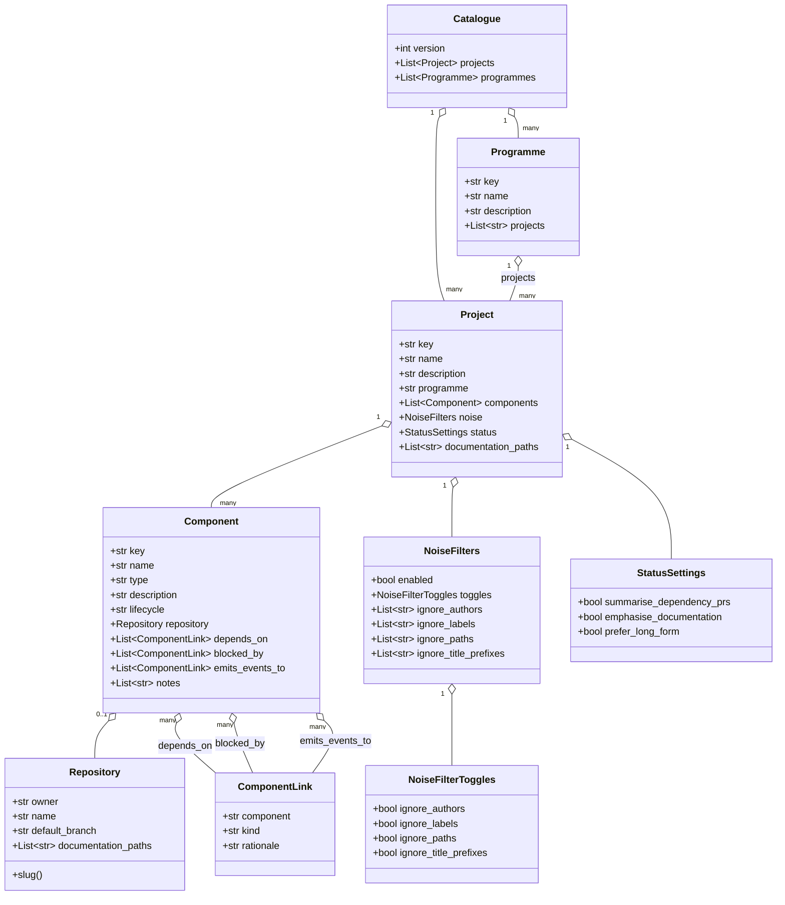
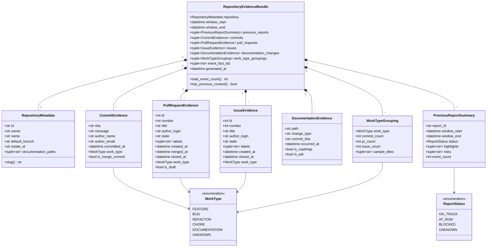
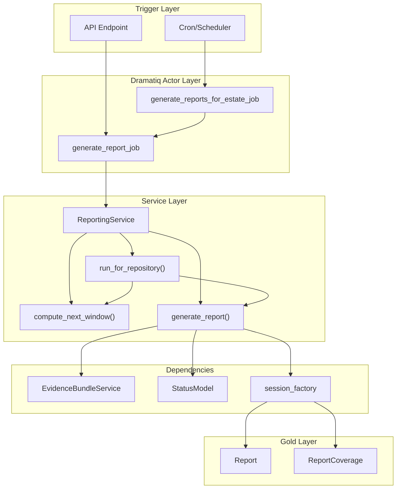
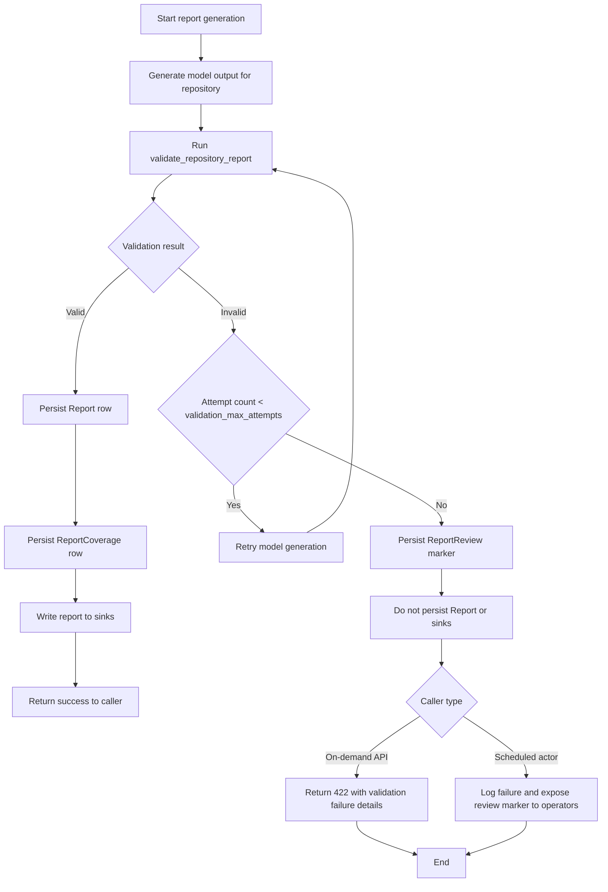
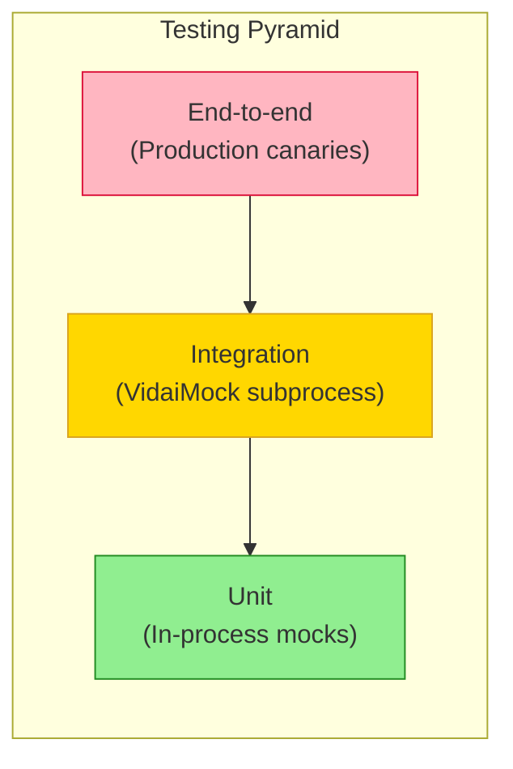
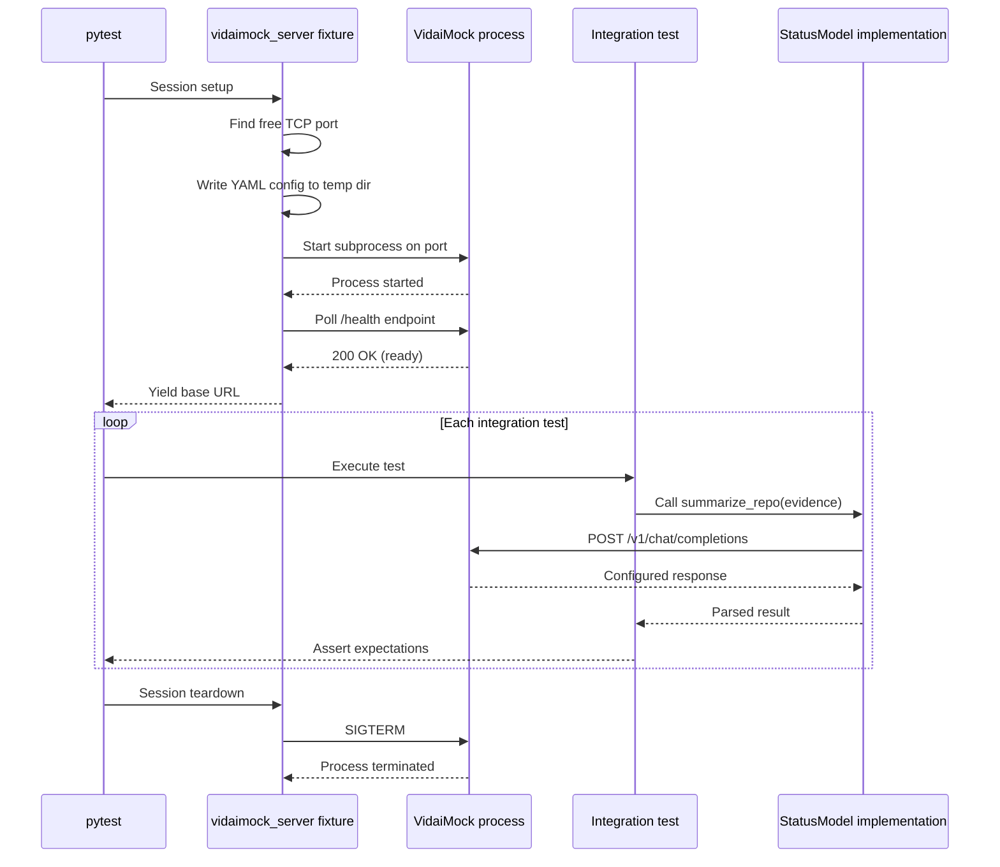

# Ghillie: High-Fidelity Architectural Specification for Intelligent Estate Status Reporting and Governance Integration

## 1. Strategic Context and Architectural Vision

In the contemporary landscape of software engineering, the management of
large-scale technical estates has transitioned from a static inventory problem
to a dynamic intelligence challenge. Organizations no longer struggle merely to
list their repositories; rather, the difficulty lies in synthesizing the
velocity, health, and compliance posture of thousands of disparate software
assets into a coherent narrative. This document outlines the comprehensive
architectural design for **Ghillie**, a system engineered to provide automated,
intelligent status updates on GitHub estates.

Critically, this design operates in tandem with **Concordat**, a distinct but
highly integrated system responsible for the enforcement of governance
standards. While Concordat acts as the active control plane—driving enrolment,
detecting violations, and enforcing policies—Ghillie serves as the
observational data plane. It aggregates signals of engineering activity
(commits, pull requests, roadmap updates) and compliance status (violations,
enrolment events) to produce high-fidelity, human-readable reports. The synergy
between these systems relies on a clear separation of concerns: Concordat
enforces, while Ghillie observes and narrates.

The architectural philosophy underpinning Ghillie is derived from the
**Medallion Architecture** pattern commonly found in modern data lakehouses.1
This pattern dictates a progressive refinement of data—from raw ingestion
(Bronze), to cleaned and enriched structures (Silver), and finally to
aggregated business-level intelligence (Gold). By adopting this structure,
Ghillie ensures that the final status reports presented to engineering
leadership are traceable back to immutable source events, providing the
auditability required in regulated industries. Furthermore, the system
leverages the emergent capabilities of **Large Language Models (LLMs)** to
perform hierarchical summarization, transforming the granular noise of git logs
into strategic insights.2

This specification is targeted at senior implementors and system architects. It
details the data flows, schema designs, API surfaces, and integration patterns
necessary to construct Ghillie as a scalable, production-grade platform.

## 2. The Medallion Data Architecture

The core of Ghillie’s data processing strategy is the Medallion Architecture.
This design pattern serves as the backbone for organizing data quality and
state transitions, ensuring that the system can handle the high velocity of
engineering data while maintaining the structural integrity required for
accurate reporting.

### 2.1 Bronze Layer: Raw Ingestion and Immutable History

The Bronze layer acts as the landing zone for all external signals entering the
Ghillie ecosystem. In a distributed software estate, data arrives in various
formats and velocities—bursty webhooks from GitHub during CI/CD storms,
periodic compliance snapshots from Concordat, and asynchronous roadmap updates.
The primary design constraint for the Bronze layer is write throughput and data
fidelity.

All incoming data is stored in its native, raw format. For GitHub webhooks,
this means capturing the full JSON payload of `push`, `pull_request`, and
`issue` events.4 For Concordat events, the system ingests **CloudEvents**
compliant messages without attempting immediate validation or transformation.5
This “store first, process later” approach decouples the ingestion
infrastructure from the complex business logic of the processing pipeline,
ensuring that no data is lost due to processing errors or schema mismatches.

The Bronze layer facilitates a crucial capability: **replayability**. As
governance rules evolve—a concept central to **Governance as Code** 7—it may
become necessary to re-evaluate historical data against new policies. By
retaining the raw inputs, Ghillie allows for the reprocessing of historical
events to generate retroactive insights or correct reporting errors without
needing to re-fetch data from upstream providers, which may be rate-limited or
ephemeral.

### 2.2 Silver Layer: Refined Inventory and Enriched State

Data moving from Bronze to Silver undergoes cleaning, deduplication, and
normalization. This layer represents the “Source of Truth” for the current
state of the estate.

In the context of Ghillie, the Silver layer is where the raw stream of events
is reconciled into a coherent entity model. GitHub commits are linked to
specific repositories and authors; raw compliance violation events are
associated with persistent team identities. This reconciliation process tackles
the challenge of **schema drift** and data consistency.8 For instance, a
repository might be renamed or transferred between organizations; the Silver
layer tracks these lifecycle events to maintain a stable identifier for the
asset, ensuring that historical status reports remain accessible even as the
underlying metadata changes.

The Silver layer also manages the integration of disparate data sources. It
joins the engineering velocity data (derived from GitHub) with the compliance
health data (ingested from Concordat). This join is critical for the “Ghillie”
value proposition: a status report that does not just list what was built, but
also qualifies _how_ it was built in the context of organizational standards.
The use of **PostgreSQL** with **JSONB** columns is recommended here to balance
the relational rigidity of entity mapping (Teams to Repositories) with the
flexibility required to store diverse compliance violation payloads.9

### 2.3 Gold Layer: Aggregated Intelligence and Reporting

The Gold layer is the consumption-ready tier, optimized for read-heavy
operations and analytics. Here, the granular data from the Silver layer is
aggregated into high-level metrics and narrative summaries.

This layer houses the final **Status Reports**. These are not simple data dumps
but synthesized documents generated by the Intelligence Engine. They contain
calculated **DORA metrics** (Deployment Frequency, Lead Time for Changes)
alongside the LLM-generated qualitative summaries.11 The data in the Gold layer
is structured to support immediate rendering by frontend applications,
specifically the **Backstage** developer portal plugin.13 Querying the Gold
layer should require zero computation; the heavy lifting of summarization and
metric calculation is performed upstream during the Silver-to-Gold transition.

By strictly adhering to this three-tier architecture, Ghillie avoids the common
pitfall of “spaghetti code” in data pipelines, where transformation logic is
scattered across the application. Instead, data flows logically from raw chaos
(Bronze) to structured order (Gold), enabling robust governance and
observability throughout the reporting lifecycle.

## 3. Ingestion Gateway: The Observer Pattern

The Ingestion Gateway is the sensory organ of Ghillie. It is responsible for
the reliable collection of signals from the external environment. Given the
scale of modern software estates, which may generate thousands of events per
minute, the gateway must be designed for high availability and asynchronous
processing.

### 3.1 Webhook Reception and Verification

The primary mechanism for real-time data acquisition is the webhook. Ghillie
exposes a secure HTTP endpoint to receive POST requests from GitHub and
Concordat. This component, ideally implemented in a high-concurrency language
like Go or Python with an async framework (e.g., FastAPI or Flask with Celery)
4, must perform minimal processing to minimize latency.

Upon receiving a request, the gateway’s first responsibility is security. It
must verify the cryptographic signature of the payload—such as the
`X-Hub-Signature-256` header provided by GitHub—to ensure the data originates
from a trusted source.4 This prevents spoofing attacks where malicious actors
might attempt to inject false status updates or compliance violations. Failed
verifications are logged as security incidents, but the payload is discarded
immediately to protect the downstream Bronze layer.

### 3.2 Asynchronous Event Buffering

To handle the “bursty” nature of engineering events—such as a mass-merge of
pull requests on a Friday afternoon or a scheduled compliance scan triggered by
Concordat—the gateway utilizes an **Event Buffer**. This is typically
implemented using a durable message queue like **Apache Kafka** or **AWS
SQS**.16

The gateway writes the verified raw payload to the buffer and immediately
acknowledges the HTTP request with a `202 Accepted` status. This asynchronous
pattern decouples the ingestion rate from the processing rate. It ensures that
a spike in traffic does not overwhelm the complex processing logic of the
Silver layer or the computationally expensive LLM operations in the
Intelligence Engine. This design aligns with the **Circuit Breaker** and
**Buffer** patterns found in resilient distributed systems 17, protecting
Ghillie from cascading failures during peak load.

### 3.3 Integration with Concordat via CloudEvents

Ghillie’s integration with Concordat is architected around the **CloudEvents
v1.0 specification**.5 This standard defines a common envelope for event data,
allowing Ghillie to consume governance signals without intimate knowledge of
Concordat’s internal logic.

Concordat acts as the event producer, emitting signals when specific lifecycle
changes occur. The two primary event types Ghillie listens for are
**Enrolment** and **Violation**. By standardizing on CloudEvents, the system
achieves loose coupling. If Concordat updates its internal policy
engine—switching, for example, from OPA (Open Policy Agent) to a custom rule
evaluator—the structure of the emitted event remains consistent, and Ghillie’s
ingestion logic requires no modification.18

#### Table 1: CloudEvents Integration Schema

| **Attribute**     | **Description**                           | **Example Value**                                | **Requirement** |
| ----------------- | ----------------------------------------- | ------------------------------------------------ | --------------- |
| `specversion`     | The version of the CloudEvents spec.      | `1.0`                                            | Mandatory 5     |
| `type`            | The specific governance event type.       | `concordat.compliance.violation`                 | Mandatory       |
| `source`          | The URI of the Concordat policy engine.   | `/concordat/policies/security`                   | Mandatory       |
| `subject`         | The identifier of the affected asset.     | `github.com/acme/payment-gateway`                | Mandatory       |
| `time`            | Timestamp of the detection.               | `2023-11-01T14:30:00Z`                           | Mandatory       |
| `datacontenttype` | Format of the payload.                    | `application/json`                               | Mandatory       |
| `data`            | The payload containing violation details. | `{ "severity": "HIGH", "rule": "no-public-s3" }` | Mandatory 19    |

This schema ensures that every piece of compliance data entering Ghillie
carries sufficient context (time, source, subject) to be routed and processed
correctly, regardless of the underlying compliance check that generated it.

### 3.4 Estate catalogue constraints (Phase 1.1)

- Catalogue files are parsed with a YAML 1.2 loader, so ambiguous scalars such
  as `on` stay as strings. This avoids silent type flips when repository
  branches or labels resemble boolean values.
- Projects, programmes, and components use globally unique, lowercase slug
  keys. This keeps dependency edges unambiguous even when components span
  projects.
- Components capture directed links via `depends_on`, `blocked_by`, and
  `emits_events_to`, each with an optional dependency `kind` (`runtime`, `dev`,
  `test`, `ops`) to signal how ingestion noise filters should treat them.
- Repository entries may declare `documentation_paths` so ingestion can follow
  repository-scoped roadmaps and ADR directories instead of relying only on
  project-level documentation paths.
- Noise filters and status preferences live in the catalogue and are persisted
  onto project rows during import. Noise filters include a global `enabled`
  flag plus per-filter toggles, so operators can switch filters on or off via
  catalogue updates. Setting `summarise_dependency_prs: false` tells downstream
  reporting jobs not to summarize dependency-only pull requests.
- The schema is defined with `msgspec` structures and exported as a JSON Schema
  consumed by `pajv`. The shipped example catalogue
  (`examples/wildside-catalogue.yaml`) exercises multi-repo projects, planned
  components without repositories, and cross-project dependencies into the df12
  shared libraries.

#### Catalogue class diagram



#### Noise filter ingestion behaviour (Task 1.3.c)

Noise filters are applied at GitHub ingestion time, before persisting to the
Bronze `raw_events` table. The ingestion worker loads the project noise
configuration from the catalogue database each run, so changes take effect
without code changes.

When the catalogue query fails due to a transient connectivity error, the
worker logs a warning and proceeds with an effectively empty noise filter set,
so ingestion can continue. Non-operational SQLAlchemy errors (schema drift,
query bugs) are treated as fatal and cause the ingestion run to fail, making
misconfiguration visible to operators rather than silently failing open.

To prevent ingestion from stalling when filtered events dominate an activity
stream, `github_ingestion_offsets` tracks both the persisted watermark
(`*_ingested_at`) and a catch-up "seen" watermark (`*_seen_at`). During backlog
catch-up (cursor-based pagination), the worker keeps the query watermark stable
while storing the newest timestamp it has _seen_; when catch-up completes it
advances the persisted watermark to the newest seen timestamp even if those
newest events were dropped as noise.

`ignore_paths` is currently evaluated only for events that include a `path`
field (documentation change events). Commit ingestion does not yet fetch a
per-commit file list in Phase 1, so path-based filtering cannot be applied to
generic commit events without additional GitHub API calls.

#### Ingestion observability (Task 1.3.d)

The ingestion worker emits structured log events at key lifecycle points,
enabling operators to monitor throughput, identify failures, and detect stalled
ingestion without inspecting database state directly.

**Event types:**

- `ingestion.run.started`: Emitted when ingestion begins for a repository.
- `ingestion.run.completed`: Emitted on successful completion with counts and
  duration.
- `ingestion.run.failed`: Emitted on error with categorized error type and
  message.
- `ingestion.stream.completed`: Emitted after each stream (commit, PR, issue,
  doc) completes.
- `ingestion.stream.truncated`: Emitted when a stream hits `max_events_per_kind`
  and backlog exists.

Events are emitted via femtologging to keep ingestion workers async-friendly
and to capture exception payloads using `exc_info` where failures occur.

All events include `repo_slug` and `estate_id` for log aggregator filtering.
Failure events classify errors into categories (`transient`, `client_error`,
`schema_drift`, `configuration`, `database_connectivity`, `data_integrity`,
`database_error`, `unknown`) to support alert routing.

**Lag computation:**

Ingestion lag is computed on-demand from `github_ingestion_offsets` watermarks
via `IngestionHealthService`:

- `time_since_last_ingestion_seconds`: Age of newest watermark (None if never
  ingested).
- `oldest_watermark_age_seconds`: Age of oldest stream watermark.
- `has_pending_cursors`: True if any stream has a resume cursor (backlog).
- `is_stalled`: True if lag exceeds configurable threshold (default 1 hour) or
  repository has never been successfully ingested.

Operators can query `get_stalled_repositories()` periodically to detect
ingestion health issues without parsing logs.

## 4. The Intelligence Engine: Hierarchical Summarization

The defining feature of Ghillie is its ability to transform raw data into
“Intelligence.” This is achieved through the Intelligence Engine, a subsystem
that employs **Large Language Models (LLMs)** within a **Map-Reduce** framework
to generate narrative status reports.

### 4.1 The Context Window Challenge and Map-Reduce Strategy

Summarizing the activity of a single repository with a handful of commits is a
trivial task for modern LLMs. However, summarizing an entire estate—comprising
hundreds of repositories and thousands of commits—far exceeds the context
window limitations of even the most advanced models.20 To address this, Ghillie
implements a hierarchical **Map-Reduce** pattern.21

The **Map Phase** operates at the repository level. The engine retrieves the
relevant data for a specific repository from the Silver layer: the last
reporting period’s commit messages, pull request titles, and file diff
summaries. It then invokes the LLM to generate a “Micro-Summary” of that
specific repository. This summary focuses on identifying key changes, such as
“Refactored the authentication module” or “Updated dependency versions.”

The **Reduce Phase** operates at the estate or team level. It takes the
collection of Micro-Summaries generated in the Map Phase and feeds them as
input into a second LLM call. The prompt for this phase instructs the model to
aggregate the individual updates into a cohesive narrative, identifying broad
trends (e.g., “Multiple teams are focusing on technical debt reduction this
sprint”) and highlighting systemic issues. This hierarchical approach allows
Ghillie to scale linearly with the size of the estate; adding more repositories
simply increases the number of parallel Map operations without overwhelming the
final aggregation step.2

### 4.2 Roadmap Extraction and Intent Parsing

To determine if a project is “on track,” Ghillie must understand the project’s
intent. This intent is typically captured in unstructured `ROADMAP.md` files
within the repositories. The Intelligence Engine uses a specialized extraction
pipeline to parse these files.23

Using a **Few-Shot Learning** prompt strategy, the LLM is tasked with
extracting structured data from the free-text roadmap. It identifies
“Initiatives,” “Target Dates,” and “Current Status” labels, converting them
into a standardized JSON schema.24 This structured intent is then compared
against the actual engineering velocity (commits and PRs) during the
summarization process. If the roadmap states that a feature is “In Progress”
but no related commits have been observed in the last 30 days, the Intelligence
Engine flags this discrepancy in the final report, offering a nuanced view of
project health that goes beyond simple tick-box compliance.

### 4.3 Chain-of-Thought Prompting for Engineering Personas

The quality of the generated report depends entirely on the quality of the
prompt. Ghillie utilizes **Chain-of-Thought (CoT)** prompting to ensure the LLM
mimics the reasoning process of a seasoned Engineering Manager.26

The prompt structure is designed to force the model to “think” before it writes.

1. **Analysis Step:** “Review the list of commits and file changes. Categorize
   them into ‘Features’, ‘Bug Fixes’, ‘Chore’, and ‘Refactoring’.”
2. **Impact Assessment:** “Identify any changes that appear to be ‘Breaking
   Changes’ or major architectural shifts based on the file paths modified
   (e.g., changes to `/api/v1/` or database migrations).”
3. **Synthesis:** “Draft a status update that highlights the Features and major
   Fixes. Correlate these with the provided Roadmap items.”
4. **Tone Adjustment:** “Refine the language to be professional, concise, and
   suitable for an executive audience. Avoid technical jargon where simple
   business terms suffice.”.28

This step-by-step instruction set reduces the likelihood of **Hallucinations**,
where the model invents features that were never built, by grounding the
generation process in specific, verifiable data points retrieved from the
Silver layer.20

## 5. Integration with Concordat: Governance as Code

The interaction between Ghillie and Concordat is the embodiment of the
**Governance as Code** philosophy. In this paradigm, governance is not a
manual, bureaucratic overlay but an automated, code-driven part of the software
delivery lifecycle.7

### 5.1 Enrolment Driving Estate Membership

Concordat controls the definition of the “Managed Estate.” Ghillie does not
arbitrarily scan the internet; it listens for **Enrolment Events** from
Concordat. When a new repository is onboarded into the governance framework,
Concordat emits a `concordat.estate.enrolment.created` event.

Upon receiving this event, Ghillie performs a **Backfill Operation**. It
instantiates a new record in its `repositories` table and immediately triggers
a job to fetch historical context from GitHub via the GraphQL API. This ensures
that when the first status report is generated, the system already possesses a
baseline understanding of the repository’s recent history (e.g., the last 30
days of activity).29 This tight coupling of enrolment and observation ensures
that “Shadow IT” is excluded from reporting, while every sanctioned asset is
automatically tracked from the moment of its inception.

Implementation note: the Phase 1 ingestion worker is implemented as
`ghillie.github.GitHubIngestionWorker`, backed by `GitHubGraphQLClient`. The
worker stores per-repository, per-entity watermarks in
`github_ingestion_offsets` (GitHub Ingestion Offsets)
(`last_commit_ingested_at`, `last_pr_ingested_at`, `last_issue_ingested_at`,
`last_doc_ingested_at`) and polls GitHub for activity occurring after the last
successful ingestion time, using a small overlap window to tolerate clock skew
and eventual consistency.

### 5.2 Violations as First-Class Reporting Citizens

Compliance violations are not merely metadata; they are critical indicators of
project health. In the Ghillie architecture, a violation is treated as a
persistent state object that modifies the generated status report.

When Concordat detects a policy breach—for instance, a repository failing to
require code review on the `main` branch—it emits a
`concordat.compliance.violation.detected` event. Ghillie ingests this and
updates the repository’s “Compliance Scorecard.”

During the **Map-Reduce** summarization phase, these active violations are
injected into the LLM’s context. The prompt instructs the model to
contextualize the engineering progress with the compliance debt. The resulting
narrative might read: _“The Payments Team delivered the new Checkout API
(Feature), achieving 99.9% availability. However, the repository currently
carries a Critical Compliance Violation regarding unencrypted secrets, which
must be remediated prior to the next release cycle.” This integration ensures
that velocity is never reported in isolation from risk, reinforcing a culture
where compliance is a prerequisite for success.30

### 5.3 Handling Schema Flexibility with JSONB

Compliance rules are inherently volatile. A new regulation (e.g., GDPR, AI
Safety Act) may introduce new data fields that need to be tracked—data
residency requirements, model training logs, or third-party vendor
assessments.18 Designing a relational schema that anticipates every possible
future compliance field is impossible.

To address this, Ghillie utilizes the **JSONB** data type in PostgreSQL for
storing violation details. While the core attributes of a violation (ID,
Repository ID, Severity, Status) are stored in structured relational columns to
support fast indexing and joining, the variable payload—containing the specific
technical details of the violation—is stored in a JSONB column.9 This allows
Ghillie to ingest and store complex, nested violation data from Concordat
without requiring schema migrations. It supports the **Open/Closed Principle**:
the system is open for extension (new violation types) but closed for
modification (no database schema changes needed).

## 6. Data Modeling and Storage Strategy

The data layer of Ghillie is designed to balance the structural rigor of an
asset inventory with the flexibility of a document store. The choice of
**PostgreSQL** as the primary persistence technology enables this hybrid
approach.

### 6.1 Entity Relationship Design

The schema is centered around the concept of the **Estate**, which acts as the
root of the hierarchy.

- `estates`: Represents a logical grouping, such as a Business Unit or
  Organization.
- `teams`: Represents the human structure. Compliance violations are often
  assigned to teams for remediation.
- `repositories`: The core technical asset. This table contains the
  `concordat_enrolment_status` flag, which acts as a circuit breaker for
  processing. If a repo is unenrolled in Concordat, Ghillie ceases to update
  its status to save resources.
- `status_reports`: A historical log of generated reports. This table is
  immutable; once a report is generated and signed off, it is preserved for
  audit purposes.
- `compliance_violations`: A hybrid table linking structured severity data with
  unstructured evidence data.

#### Table 2: Core Schema Specifications

| **Table Name** | **Primary Key**  | **Foreign Keys** | **Storage Strategy** | **Rationale**                                                                                                              |
| -------------- | ---------------- | ---------------- | -------------------- | -------------------------------------------------------------------------------------------------------------------------- |
| `repositories` | `repo_id` (UUID) | `team_id`        | Relational           | Strict referential integrity is required to ensure reports are linked to valid owners.33                                   |
| `commits`      | `commit_sha`     | `repo_id`        | Relational           | High-volume transactional data; relational structure optimizes time-series queries (e.g., “commits in last 7 days”).29     |
| `violations`   | `violation_id`   | `repo_id`        | Relational + JSONB   | Hybrid approach allows querying by severity (Relational) while storing diverse evidence payloads (JSONB).10                |
| `raw_events`   | `event_id`       | None             | Append-Only Log      | The Bronze layer storage. No foreign keys to allow high-speed ingestion without locking.1                                  |

### 6.2 Metric Definitions and Calculation

Ghillie automates the calculation of key engineering metrics to augment the
text summaries.

- **Deployment Frequency:** Calculated by counting the number of `push` events
  to the `main` branch or specific `release` tags within the reporting window.11
- **Lead Time for Changes:** Measured as the duration between the first commit
  timestamp on a feature branch and the timestamp of the merge event into
  `main`.34
- **Compliance Score:** A weighted aggregate metric derived from the active
  violations in the `compliance_violations` table. The formula typically
  penalizes Critical violations heavily (e.g., -10 points) and Low violations
  lightly (e.g., -1 point), normalizing the score to a 0-100 scale.35
- **Roadmap Adherence:** A synthetic metric derived by the Intelligence Engine,
  estimating the percentage of Roadmap “In Progress” items that have associated
  commit activity.23

## 7. API and Presentation: Integration with Backstage

The value of Ghillie is realized only when its insights are consumed by
stakeholders. The primary consumption channel is the **Backstage** internal
developer portal.

### 7.1 The Backstage Plugin Architecture

Ghillie provides a custom **Backstage Plugin**.13 This plugin is composed of a
frontend component (written in React) and a backend service connector.

The frontend component is designed to integrate into the **Entity Page** of a
repository. When a user navigates to a service in Backstage, the Ghillie plugin
renders a “Status Card.”

- **Left Panel (Narrative):** Displays the latest LLM-generated Executive
  Summary.
- **Right Panel (Metrics):** Visualizes the DORA metrics and the Compliance
  Health Score using a traffic-light system (Green/Amber/Red).14

The plugin communicates with the Ghillie backend via a standardized REST API.
It uses the Backstage **Identity API** to pass the user’s credentials, ensuring
that the user is authorized to view the status of the requested entity.37

### 7.2 Catalog Ingestion and Mapping

To ensure seamless integration, Ghillie consumes the `catalog-info.yaml` files
used by Backstage. This allows Ghillie to map the GitHub repository URL (e.g.,
`github.com/org/repo`) to the Backstage Entity Reference (e.g.,
`component:default/my-service`).

This mapping is critical for the “Governance as Code” workflow. It allows
Ghillie to report status not just by repository, but by “System” or “Domain” as
defined in the Backstage catalog. If a System is composed of five
microservices, Ghillie can aggregate the status of all five repositories into a
single System-level report using its Map-Reduce capability, providing
high-level visibility to System Owners.13

## 8. Security, Scalability, and Operational Considerations

### 8.1 Least Privilege and Data Security

Ghillie processes sensitive information: source code metadata, unreleased
feature plans (Roadmaps), and compliance vulnerabilities. Security is paramount.

- **GitHub Permissions:** The system uses a GitHub App for authentication. It
  requests the minimum necessary scopes: `Metadata: Read-Only` and
  `Contents: Read-Only` (specifically for `ROADMAP.md`). It does _not_ request
  access to source code blobs, reducing the blast radius in the event of a
  compromise.39
- **Row Level Security (RLS):** At the database level, RLS policies enforce
  tenant isolation. If Ghillie is deployed as a multi-tenant service (e.g.,
  serving multiple distinct business units), RLS ensures that a query from
  Business Unit A cannot retrieve status reports belonging to Business Unit B.40

### 8.2 Handling GitHub Rate Limits via GraphQL

A major scalability challenge is the GitHub API rate limit. Relying on REST API
calls for every commit fetch will quickly exhaust the quota for large estates.

Ghillie mitigates this by prioritizing the **GitHub GraphQL API**.41 GraphQL
allows the system to fetch precisely the data needed (Commit Message, Date,
Author) and nothing else, reducing payload size. More importantly, it allows
for **bulk fetching**—retrieving the status of multiple pull requests in a
single HTTP round-trip. The “Silver Layer” processing pipeline utilizes
cursor-based pagination to efficiently traverse large commit histories without
triggering abuse detection mechanisms.29

### 8.3 Future-Proofing for “Agentic” Governance

The architecture is designed to support future advancements in AI. The current
implementation uses LLMs for _summarization_ (Read-Only). However, the
structure allows for future _agentic_ capabilities.

Because the Bronze layer retains the raw events and the Silver layer maintains
a structured state, future versions of the Intelligence Engine could be granted
“Write” permissions to potentially _fix_ compliance violations (e.g., opening a
PR to add a missing `CODEOWNERS` file). The separation of the Intelligence
Engine from the core data pipeline ensures that adding such active capabilities
would not destabilize the reporting infrastructure, paving the way for a true
**Self-Healing Estate**.43

### 8.4 HTTP API Layer Architecture

The Ghillie HTTP API follows a hexagonal (ports and adapters) architecture,
placing the Falcon Asynchronous Server Gateway Interface (ASGI) application at
the adapter boundary between external HTTP consumers and the core Medallion
data layers.

**Current implementation (Phase 2.3.c):** The modular API structure has been
partially implemented. The runtime module (`ghillie.runtime`) delegates to the
`ghillie.api.app` application factory. The modular package structure is:

```plaintext
ghillie/api/
  __init__.py         # Package root, exports create_app
  app.py              # Application factory with AppDependencies dataclass
  factory.py          # build_reporting_service() for API layer
  middleware.py       # SQLAlchemySessionManager (request-scoped sessions)
  errors.py           # Domain exceptions and Falcon error handlers
  health/
    resources.py      # HealthResource, ReadyResource
  gold/
    resources.py      # ReportResource (on-demand report generation)
```

The following components are implemented:

- **Health probe endpoints** (`/health`, `/ready`): Stateless, always
  registered regardless of database availability.
- **On-demand report generation**
  (`POST /reports/repositories/{owner}/{name}`): Triggers report generation for
  a specific repository, using the same pipeline as scheduled reports. Returns
  200 with report metadata, 204 when no events exist in the window, or 404 when
  the repository slug is unknown.
- **Session middleware** (`SQLAlchemySessionManager`): Provides
  request-scoped `AsyncSession` instances with automatic commit/rollback/close
  per the pattern documented in `async-sqlalchemy-with-pg-and-falcon.md`.
- **Error handlers**: Map `RepositoryNotFoundError` to 404 and
  `InvalidInputError` to 400.

**Planned evolution:** As additional domain endpoints are added (Concordat
CloudEvents ingestion, estate-level queries), corresponding resource modules
should be created under `ghillie/api/bronze/` and `ghillie/api/gold/`.

This structure maintains clear separation between:

- **Infrastructure adapters** (health probes): No domain logic, stateless
- **Inbound adapters** (CloudEvents ingestion): Write path to Bronze layer
- **Outbound adapters** (status queries, on-demand reports): Read/write path
  to Gold layer

**Design decisions:**

- Health probe endpoints remain in a separate resource module from domain
  endpoints. This allows Kubernetes operators to understand which endpoints
  serve operational purposes versus functional purposes.
- `AppDependencies` frozen dataclass groups `session_factory` and
  `reporting_service` to keep constructor argument counts within lint
  thresholds (`max-args = 4`).
- `ReportResource` reuses the request-scoped session from
  ``req.context.session`` for repository slug lookups, keeping all reads within
  the middleware's transaction.  The ``ReportingService`` manages its own
  sessions internally for report generation.
- `GHILLIE_DATABASE_URL` controls whether the runtime starts in health-only
  mode or full mode with domain endpoints, maintaining backwards compatibility
  with existing deployments.

## 9. Evidence Bundle Architecture (Phase 2.1)

The evidence bundle provides an in-memory representation of repository activity
within a reporting window, ready for LLM summarization. This structure is the
foundation for Phase 2's repository-level status reports.

### 9.1 Design Decisions

**msgspec with frozen=True:** Evidence structs use `msgspec.Struct` with
`frozen=True` for immutability and efficient serialization. This matches
catalogue model patterns and enables future JSON export for model prompts. The
frozen constraint ensures thread safety when bundles are passed between
processing stages.

**Tuples over lists:** Evidence collections use `tuple[T, ...]` rather than
`list[T]` to enforce immutability at the type level. This prevents accidental
mutation during report generation and provides clear documentation of intent.

**Work type classification hierarchy:** Labels take precedence over title
patterns because labels represent explicit author intent, while title patterns
are heuristic inference. The classification order (bug > feature > refactor >
documentation > chore) prioritizes specificity:

1. Bug labels/patterns are checked first as they typically require immediate
   attention.
2. Feature work is identified next as it represents planned deliverables.
3. Refactoring indicates technical improvement without functional change.
4. Documentation changes are important for project health visibility.
5. Chores capture maintenance work that keeps the project running.
6. Unknown is the fallback when no pattern matches.

**Previous report limit:** Maximum two previous reports are included to provide
trend context without overwhelming the evidence bundle. This balances LLM
context window constraints with historical awareness. The reports are ordered
most-recent-first to prioritize immediate context.

**EventFact ID tracking:** The bundle tracks `event_fact_ids` to enable
downstream report coverage recording without re-querying the database. This
preserves the deterministic Bronze→Silver→Gold linkage required for audit
trails.

**Scope-specific coverage:** Evidence bundle selection excludes EventFacts
already covered by repository-scoped reports only. Project and estate reports
do not suppress repository evidence, keeping repository bundles complete and
independent of higher-level reporting runs. Coverage is global per repository
scope, so once an EventFact is covered by a repository report it is not reused,
even if later runs backfill overlapping windows.

**Window semantics:** `window_start` is inclusive and `window_end` is
exclusive, matching Python range conventions and simplifying consecutive window
generation. This means events occurring exactly at `window_end` are excluded,
which allows non-overlapping windows to be generated by using the previous
`window_end` as the next `window_start`.

**Merge commit exclusion from groupings:** Merge commits are flagged via
`is_merge_commit` but excluded from work type groupings because they typically
duplicate PR activity and add noise to summaries. The merge commit itself is
still included in the commits list for completeness.

### 9.2 Evidence Bundle Structure



### 9.3 Classification Configuration

Work type classification is configurable via `ClassificationConfig`. The
default configuration recognizes common label conventions and conventional
commit patterns:

**Default label patterns:**

| Work Type     | Labels                                                    |
| ------------- | --------------------------------------------------------- |
| Bug           | bug, bugfix, fix, defect, hotfix                          |
| Feature       | feature, enhancement, new feature, feat                   |
| Refactor      | refactor, refactoring, tech debt, technical debt, cleanup |
| Chore         | chore, maintenance, dependencies, deps, ci, build         |
| Documentation | documentation, docs, doc                                  |

**Default title patterns (conventional commits):**

| Work Type | Patterns                                                |
| --------- | ------------------------------------------------------- |
| Bug       | `^fix(\(.+\))?:`, `^bugfix:`, `^hotfix:`, `\bfix(es)?b` |
| Feature   | `^feat(\(.+\))?:`, `^add\s`, `^implement\s`             |
| Refactor  | `^refactor(\(.+\))?:`, `\brefactor\b`, `\bcleanup\b`    |
| Chore     | `^chore(\(.+\))?:`, `^ci(\(.+\))?:`, `\bbump\b`         |

Custom configurations can be provided to `EvidenceBundleService` to match
project-specific conventions.

### 9.4 Status model interface (Phase 2.2)

The status model interface abstracts LLM-backed summarization behind a
`StatusModel` protocol. This enables:

- Vendor-agnostic model switching (OpenAI, Gemini via OpenRouter)
- Deterministic mock implementations for testing
- Future agentic capabilities without pipeline changes

**Protocol design:** The protocol uses `runtime_checkable` to support
isinstance checks without enforcing inheritance. All methods are async to match
the async-first architecture of the evidence and reporting pipeline.

```python
@runtime_checkable
class StatusModel(Protocol):
    async def summarize_repository(
        self,
        evidence: RepositoryEvidenceBundle,
    ) -> RepositoryStatusResult: ...
```

**Output structure:** `RepositoryStatusResult` mirrors the expected JSON schema
from the proposal, using `ReportStatus` for status codes. The struct includes:

- `summary`: Narrative text describing repository status
- `status`: One of `ON_TRACK`, `AT_RISK`, `BLOCKED`, `UNKNOWN`
- `highlights`: Key achievements (up to 5)
- `risks`: Identified concerns (up to 5)
- `next_steps`: Suggested actions (up to 5)

The `to_machine_summary()` helper converts the frozen struct to a dict suitable
for storage in `Report.machine_summary`.

**Mock implementation:** `MockStatusModel` uses deterministic heuristics for
testing without LLM dependencies:

1. Empty evidence bundle → UNKNOWN
2. Previous reports with risks and AT_RISK/BLOCKED status → AT_RISK
3. Bug activity exceeds feature activity → AT_RISK
4. Otherwise → ON_TRACK

The mock generates contextual summaries mentioning repository slugs and event
counts, extracts highlights from feature work type groupings, carries forward
previous risks with "(Ongoing)" prefix, and suggests next steps based on open
PRs and issues.

**Integration with Gold layer:** Status results map directly to the `Report`
model:

- `RepositoryStatusResult.summary` → `Report.human_text`
- `to_machine_summary(result)` → `Report.machine_summary`
- Model identifier (e.g., "mock-v1", "gpt-5.1-thinking") → `Report.model`

This satisfies the Phase 2.2.a completion criteria: at least one implementation
of the interface is available with tests that mock model responses.

### 9.5 OpenAI status model implementation (Phase 2.2.b)

The OpenAI status model implementation (`OpenAIStatusModel`) provides the first
real LLM integration in Ghillie, connecting the `StatusModel` protocol to an
OpenAI-compatible API.

**Configuration:** The `OpenAIStatusModelConfig` dataclass follows the pattern
established by `GitHubGraphQLConfig`:

```python
@dataclass(frozen=True, slots=True)
class OpenAIStatusModelConfig:
    api_key: str
    endpoint: str = "https://api.openai.com/v1/chat/completions"
    model: str = "gpt-5.1-thinking"
    timeout_s: float = 120.0
    temperature: float = 0.3
    max_tokens: int = 2048

    @classmethod
    def from_env(cls) -> OpenAIStatusModelConfig: ...
```

Environment variables:

- `GHILLIE_OPENAI_API_KEY`: Required API key
- `GHILLIE_OPENAI_ENDPOINT`: Optional endpoint override for VidaiMock testing
- `GHILLIE_OPENAI_MODEL`: Optional model override

**Prompt design:** The implementation uses a two-part prompt structure:

1. **System prompt**: Contains JSON schema for structured output, status
   determination guidelines, and instructions to avoid repetition of unchanged
   information from previous reports.

2. **User prompt**: Serializes the `RepositoryEvidenceBundle` into structured
   sections:
   - Repository identification and reporting window
   - Previous reports context (status, highlights, risks)
   - Activity summary (counts by entity type)
   - Work type breakdown (feature, bug, documentation, etc.)
   - Pull request and issue details

The prompt explicitly requests `response_format: {"type": "json_object"}` to
ensure structured output from models that support JSON mode.

**Response parsing:** The `LLMStatusResponse` msgspec struct validates the JSON
response and provides type-safe access to fields. The `_parse_status()`
function normalizes status strings (handling case variations and hyphens) and
falls back to `UNKNOWN` for unrecognized values.

**Error handling:** Three custom exception classes provide clear error context:

- `OpenAIAPIError`: HTTP errors (with status code), rate limiting (429), and
  timeouts
- `OpenAIResponseShapeError`: Missing fields or invalid JSON in responses
- `OpenAIConfigError`: Missing or invalid configuration

**HTTP client pattern:** The implementation mirrors `GitHubGraphQLClient`:

- Accepts optional `http_client` parameter for testing
- Owns its `httpx.AsyncClient` if none provided
- Implements `aclose()` for resource cleanup
- Uses bearer token authentication

This satisfies the Phase 2.2.b completion criteria: round-trip inference
demonstrating the integration using VidaiMock.

### 9.6 Scheduled reporting workflow (Phase 2.3.a)

The reporting workflow orchestrates the end-to-end generation of repository
status reports by coordinating evidence bundle construction, status model
invocation, and report persistence to the Gold layer.

**Architecture overview:**

The workflow is implemented as a service (`ReportingService`) that can be
invoked synchronously or via Dramatiq actors for scheduled/background
execution. The service coordinates three core operations:

1. **Window computation**: Determines the reporting period based on previous
   report end times or a configurable default window.
2. **Report generation**: Builds an evidence bundle, invokes the status model,
   and persists the report with coverage records.
3. **Estate-wide scheduling**: Generates reports for all active repositories
   in an estate.

The following flowchart shows the interaction between trigger sources, Dramatiq
actors, the ReportingService, and the Gold layer persistence:



**Window computation semantics:**

The `compute_next_window()` method determines the reporting window as follows:

- If a previous repository report exists, the new window starts where that
  report's `window_end` ended, ensuring continuous coverage with no gaps.
- If no previous report exists, the window starts `config.window_days` before
  the reference time (default: 7 days).
- The window always ends at the reference time (`as_of` parameter or current
  time).

This design ensures:

- **Continuous coverage**: Each report picks up exactly where the previous one
  left off.
- **No duplicate reporting**: Events covered by previous reports are not
  re-summarized.
- **Flexible scheduling**: Reports can be generated at any cadence without
  missing activity.

**ReportingConfig dataclass:**

Configuration is centralized in `ReportingConfig`:

```python
@dataclass(frozen=True, slots=True)
class ReportingConfig:
    window_days: int = 7  # Default window when no prior report exists

    @classmethod
    def from_env(cls) -> ReportingConfig:
        # Reads GHILLIE_REPORTING_WINDOW_DAYS
```

**Dramatiq actor pattern:**

The actors follow the pattern established by `import_catalogue_job`:

- **`generate_report_job`**: Generates a single repository report. Accepts
  `database_url`, `repository_id`, and optional `as_of_iso` timestamp.
- **`generate_reports_for_estate_job`**: Iterates over all active repositories
  (`ingestion_enabled=True`) in an estate and generates reports for each.

Both actors use module-level caching for expensive resources (database engines,
service instances) to minimize overhead across invocations.

**Empty window handling:**

When a repository has no events in the computed window, `run_for_repository()`
returns `None` rather than generating an empty report. This prevents report
table pollution and makes the "no activity" state explicit to callers.

**Coverage tracking:**

Each generated report creates `ReportCoverage` records linking the report to
the `EventFact` IDs from the evidence bundle. This preserves the Bronze→Silver→
Gold audit trail and enables downstream queries to identify which events
contributed to which reports.

### 9.6.1 Report validation and retry workflow (Task 2.4.a)

Generated repository reports must pass correctness validation before persistence.
Invalid reports are retried with bounded attempts; if still invalid after maximum
retries, the report is marked for human review rather than silently persisting
broken data. This section documents the validation loop and caller-specific
failure handling.

The following flowchart illustrates the report generation, validation, and
fallback workflow:



**Workflow design:**

- **Validation loop**: After model output is generated, `validate_repository_report()` checks correctness rules (required fields, semantic constraints, data integrity).
- **Bounded retries**: Invalid reports trigger up to `validation_max_attempts` model regeneration cycles, allowing transient LLM issues (hallucinations, formatting errors) to self-correct.
- **Human review fallback**: Reports that remain invalid after max retries are persisted as `ReportReview` markers with failure details, signaling operators that manual investigation is required.
- **Caller-specific responses**: On-demand API callers receive a 422 Unprocessable Entity response with validation failure details. Scheduled actors log the failure and record the review marker for operational visibility.

This design ensures **no silent failures**: invalid reports are never stored to the Gold layer, and operators retain visibility into problematic generations for triage and remediation.

### 9.7 Report Markdown rendering and filesystem storage (Phase 2.3.b)

The reporting pipeline persists Gold layer report records in the database, but
operators also need human-readable reports at predictable filesystem paths for
browsing and version control. This section describes the Markdown renderer and
the pluggable storage interface that bridge the gap.

**Markdown renderer:**

The `render_report_markdown()` function is a pure transformation with no I/O or
database access. It accepts a `Report` record and repository metadata (`owner`,
`name`) and returns a structured Markdown string.

The renderer reads exclusively from `Report.machine_summary` (the structured
dict produced by `to_machine_summary()`) rather than `Report.human_text`. This
guarantees that the rendered Markdown content matches the database exactly,
satisfying the completion criteria for Task 2.3.b. The `human_text` field
continues to store the raw LLM summary string and is not consumed by the
renderer.

The rendered document includes:

- Title line with `owner/name` and window date range
- Status indicator (`On Track`, `At Risk`, `Blocked`, `Unknown`)
- Summary section (from `machine_summary["summary"]`)
- Highlights, Risks, and Next Steps as bulleted lists
- Metadata footer with model identifier, generation timestamp, window, and
  report ID

Sections with empty lists are omitted entirely. Missing `machine_summary` keys
are handled gracefully (section omitted, no exception raised).

**ReportSink protocol (port):**

The `ReportSink` protocol follows the hexagonal architecture pattern
established by `StatusModel`. It is defined as a `@runtime_checkable`
`Protocol` with a single async method:

```python
@runtime_checkable
class ReportSink(Protocol):
    async def write_report(
        self,
        markdown: str,
        *,
        metadata: ReportMetadata,
    ) -> None: ...
```

This abstraction enables pluggable storage backends without coupling the
reporting service to any specific output mechanism.

**Filesystem sink adapter:**

`FilesystemReportSink` implements `ReportSink` for local or mounted filesystem
output. It writes two files per invocation:

- `{base_path}/{owner}/{name}/latest.md` — overwritten with each new report,
  providing a stable entry point for operators.
- `{base_path}/{owner}/{name}/{window_end}-{report_id}.md` — accumulates
  over time, preserving report history.

Directory creation and file writes use `asyncio.to_thread()` to avoid blocking
the event loop without introducing an `aiofiles` dependency. For the small
Markdown files involved, this approach is efficient.

**Service integration:**

`ReportingService` accepts a `ReportingServiceDependencies` parameter object
grouping its three core collaborators (session factory, evidence service,
status model), plus optional `config` and `report_sink` parameters. The
`ReportMetadata` frozen dataclass groups the four report identification
parameters passed to `ReportSink.write_report()`. When a sink is provided, the
service renders Markdown and invokes the sink after each report is persisted to
the Gold layer. The private `_write_to_sink()` method fetches the `Repository`
record for `github_owner` and `github_name`, calls `render_report_markdown()`,
and delegates to the sink.

The Dramatiq actors (`_build_service()` in `ghillie/reporting/actor.py`)
conditionally create a `FilesystemReportSink` when the
`GHILLIE_REPORT_SINK_PATH` environment variable is set via
`ReportingConfig.report_sink_path`.

**Design decisions:**

1. **Renderer reads `machine_summary`, not `human_text`:** Guarantees
   database-Markdown consistency. The `human_text` field stores the raw LLM
   output and may contain formatting that does not match the structured data.

2. **No schema migration required:** This change adds no database columns.
   It only adds application-level Markdown rendering and filesystem output.

3. **`asyncio.to_thread()` over `aiofiles`:** Avoids a new dependency while
   keeping the event loop responsive. Future high-throughput adapters can use
   native async I/O.

4. **Optional sink dependency:** When no sink is provided, report generation
   works exactly as before. This ensures zero-risk adoption and makes testing
   straightforward.

5. **Protocol-based extensibility:** The `ReportSink` protocol supports
   future adapters for S3, Git push, or notification channels (Slack, email)
   without modifying the reporting service.

## 10. Integration testing strategy for LLM backends

The Intelligence Engine's reliance on external LLM providers introduces testing
challenges distinct from conventional service integration. This section
describes the strategy for verifying LLM interactions during development and
continuous integration, without incurring API costs or depending on external
service availability.

### 10.1 Testing pyramid for LLM integration

Ghillie's LLM testing follows a layered approach that balances coverage,
execution speed, and fidelity:

For screen readers: The following diagram shows a testing pyramid with unit
tests at the base, integration tests in the middle, and end-to-end tests at the
top.



**Unit tests** use in-process mock implementations of the `StatusModel`
protocol. These tests verify:

- Evidence bundle serialization and prompt construction
- Response parsing and schema validation
- Error classification and exception handling
- Retry policy configuration

**Integration tests** use VidaiMock[^vidaimock] as a subprocess, simulating
real HTTP interactions. These tests verify:

- HTTP client configuration (timeouts, connection pooling, TLS)
- Streaming response handling (Server-Sent Events)
- Provider-specific request/response shapes
- Failure mode recovery (retries, circuit breakers)

**End-to-end tests** run against production APIs with controlled inputs,
validating that real provider behaviour matches expectations. These tests
execute infrequently (for example, nightly or pre-release) and monitor for API
drift.

### 10.2 VidaiMock test fixture lifecycle

Integration tests manage VidaiMock as a session-scoped pytest fixture,
minimizing subprocess overhead across test modules.

For screen readers: The following sequence diagram shows the lifecycle of the
VidaiMock test fixture, from session setup through test execution to teardown.



The fixture performs the following steps:

1. **Port allocation:** Binds to an ephemeral port to avoid conflicts with
   parallel test runs.
2. **Configuration generation:** Writes provider-specific YAML to a temporary
   directory, including response templates and chaos settings.
3. **Process startup:** Launches VidaiMock as a subprocess with stdout/stderr
   capture for debugging.
4. **Health check:** Polls the `/health` endpoint until the server is ready,
   with a configurable timeout.
5. **URL injection:** Yields the base URL for test use, typically injecting it
   into the `StatusModel` via environment variable or constructor parameter.
6. **Graceful shutdown:** Sends SIGTERM and waits for clean termination,
   escalating to SIGKILL if necessary.

### 10.3 Response configuration and templating

VidaiMock configurations define canned responses using YAML with Tera
templating for dynamic content:

```yaml
# tests/fixtures/vidaimock/openai-happy-path.yaml
provider: openai
endpoints:
  - path: /v1/chat/completions
    method: POST
    responses:
      - match:
          body:
            messages:
              - role: user
                content: { contains: "evidence bundle" }
        response:
          status: 200
          headers:
            Content-Type: application/json
          body: |
            {
              "id": "chatcmpl-{{ uuid() }}",
              "object": "chat.completion",
              "created": {{ timestamp() }},
              "model": "gpt-5.1-thinking",
              "choices": [
                {
                  "index": 0,
                  "message": {
                    "role": "assistant",
                    "content": "## Status Summary\n\nThe repository shows..."
                  },
                  "finish_reason": "stop"
                }
              ],
              "usage": {
                "prompt_tokens": 1250,
                "completion_tokens": 350,
                "total_tokens": 1600
              }
            }
```

Response templates support:

- **Dynamic values:** `{{ uuid() }}`, `{{ timestamp() }}`, `{{ random_int() }}`
- **Request interpolation:** `{{ request.body.messages[0].content }}`
- **Conditional logic:** `...`
- **External files:** ``

### 10.4 Chaos testing patterns

VidaiMock's chaos capabilities enable systematic verification of resilience
behaviour:

#### Timeout handling

```yaml
chaos:
  latency:
    enabled: true
    min_ms: 35000
    max_ms: 40000
```

Tests verify that the `StatusModel` implementation:

- Raises a timeout exception after the configured client timeout
- Logs the timeout with request context
- Does not leave orphaned connections

#### Intermittent failures

```yaml
chaos:
  failure_rate: 0.3
  failure_modes:
    - type: http_error
      status: 503
      body: '{"error": {"message": "Service temporarily unavailable"}}'
      probability: 0.5
    - type: connection_reset
      probability: 0.3
    - type: malformed_json
      probability: 0.2
```

Tests verify that the `StatusModel` implementation:

- Retries transient failures (503, connection reset) with exponential backoff
- Fails fast on non-retryable errors (400, 401, 422)
- Parses and logs provider error messages
- Respects maximum retry limits

#### Rate limiting

```yaml
chaos:
  rate_limit:
    enabled: true
    requests_per_minute: 5
    response:
      status: 429
      headers:
        Retry-After: "60"
      body: '{"error": {"message": "Rate limit exceeded"}}'
```

Tests verify that the `StatusModel` implementation:

- Respects `Retry-After` headers
- Implements backoff when no header is present
- Surfaces rate limit errors to callers when limits persist

### 10.5 Provider parity testing

The `StatusModel` interface abstracts provider differences, but integration
tests must verify that each provider implementation handles its specific
response shape correctly. VidaiMock configurations exist per provider:

| Provider     | Configuration file  | Key differences                           |
| ------------ | ------------------- | ----------------------------------------- |
| OpenAI       | `openai.yaml`       | Standard chat completions API             |
| Anthropic    | `anthropic.yaml`    | Messages API with `content` blocks        |
| Gemini       | `gemini.yaml`       | `generateContent` with `candidates`       |
| Azure OpenAI | `azure-openai.yaml` | Deployment-based URLs                     |
| Bedrock      | `bedrock.yaml`      | AWS Signature V4, model-specific payloads |

Tests parameterized by provider run the same evidence bundle through each
implementation, verifying that:

- Request payloads conform to provider specifications
- Response parsing extracts summary, status, highlights, and risks
- Token usage metrics are captured where available
- Provider-specific errors are classified correctly

### 10.6 Test organization

Integration tests live in `tests/integration/` with the following structure:

```plaintext
tests/
├── integration/
│   ├── conftest.py              # VidaiMock fixture definitions
│   ├── fixtures/
│   │   └── vidaimock/
│   │       ├── openai.yaml
│   │       ├── anthropic.yaml
│   │       ├── gemini.yaml
│   │       ├── azure-openai.yaml
│   │       ├── bedrock.yaml
│   │       └── chaos/
│   │           ├── timeout.yaml
│   │           ├── intermittent.yaml
│   │           └── rate-limit.yaml
│   ├── test_status_model_openai.py
│   ├── test_status_model_anthropic.py
│   └── test_status_model_resilience.py
```

Tests are marked with `@pytest.mark.integration` and excluded from the default
test run. CI pipelines execute them in a dedicated stage after unit tests pass.

### 10.7 CI pipeline integration

The integration test stage in CI performs the following:

1. Downloads or caches the VidaiMock binary (from release artefacts or builds
   from source)
2. Runs `pytest -m integration` with VidaiMock configurations
3. Captures VidaiMock stdout/stderr on failure for debugging
4. Reports coverage for integration-tested code paths

VidaiMock binaries are cached between runs to avoid repeated downloads. The
cache key includes the VidaiMock version to ensure updates propagate.

[^vidaimock]: VidaiMock repository: <https://github.com/vidaiUK/VidaiMock/>

## 11. Conclusion

Ghillie represents a paradigm shift in how engineering organizations perceive
and manage their digital assets. By moving beyond static spreadsheets and
manual status meetings, it industrializes the generation of engineering
intelligence. The architecture—anchored in the robustness of the Medallion
pattern, the flexibility of Event-Driven integration, and the cognitive power
of LLMs—provides a scalable, audit-ready foundation for the modern enterprise.

The decoupling of “Enforcement” (Concordat) and “Reporting” (Ghillie) ensures
that governance does not become a bottleneck but rather a transparent, integral
part of the delivery narrative. For the implementor, this design offers a clear
blueprint: build the Bronze layer for fidelity, the Silver layer for structure,
and the Gold layer for insight, all while letting the events flow freely
through the CloudEvents standard. The result is an estate that is not just
managed, but understood.

## Works cited

1. What is a Medallion Architecture? - Databricks, accessed on November 20,
   2025,
   [https://www.databricks.com/glossary/medallion-architecture](https://www.databricks.com/glossary/medallion-architecture)
2. Hierarchical Repository-Level Code Summarization for Business Applications
   Using Local LLMs - arXiv, accessed on November 20, 2025,
   [https://arxiv.org/html/2501.07857v1](https://arxiv.org/html/2501.07857v1)
3. Repository-Level Code Understanding by LLMs via Hierarchical Summarization:
   Improving Code Search and Bug Localization - ResearchGate, accessed on
   November 20, 2025,
   [https://www.researchgate.net/publication/391739021_Repository-Level_Code_Understanding_by_LLMs_via_Hierarchical_Summarization_Improving_Code_Search_and_Bug_Localization](https://www.researchgate.net/publication/391739021_Repository-Level_Code_Understanding_by_LLMs_via_Hierarchical_Summarization_Improving_Code_Search_and_Bug_Localization)
4. Building a Real-Time GitHub Webhook Listener with Flask, MongoDB, and React
   - Medium, accessed on November 20, 2025,
   [https://medium.com/@achu1997singh/building-a-real-time-github-webhook-listener-with-flask-mongodb-and-react-0ce5bac43ac0](https://medium.com/@achu1997singh/building-a-real-time-github-webhook-listener-with-flask-mongodb-and-react-0ce5bac43ac0)
5. CloudEvents Specification - GitHub, accessed on November 20, 2025,
   [https://github.com/cloudevents/spec](https://github.com/cloudevents/spec)
6. CloudEvents |, accessed on November 20, 2025,
   [https://cloudevents.io/](https://cloudevents.io/)
7. Governance as Code: An Innovative Approach to Software Architecture
   Verification | by Agoda Engineering - Medium, accessed on November 20, 2025,
   [https://medium.com/agoda-engineering/governance-as-code-an-innovative-approach-to-software-architecture-verification-d93f95443662](https://medium.com/agoda-engineering/governance-as-code-an-innovative-approach-to-software-architecture-verification-d93f95443662)
8. Building Integrated Data Flows: How to Automate Governance & Compliance -
   Alation, accessed on November 20, 2025,
   [https://www.alation.com/blog/how-to-build-integrated-data-flows-with-compliance-built-in/](https://www.alation.com/blog/how-to-build-integrated-data-flows-with-compliance-built-in/)
9. JSONB: PostgreSQL’s Secret Weapon for Flexible Data Modeling | by Rick
   Hightower, accessed on November 20, 2025,
   [https://medium.com/@richardhightower/jsonb-postgresqls-secret-weapon-for-flexible-data-modeling-cf2f5087168f](https://medium.com/@richardhightower/jsonb-postgresqls-secret-weapon-for-flexible-data-modeling-cf2f5087168f)
10. When do JSON columns make sense in Postgres? : r/PostgreSQL - Reddit,
    accessed on November 20, 2025,
    [https://www.reddit.com/r/PostgreSQL/comments/sndijh/when_do_json_columns_make_sense_in_postgres/](https://www.reddit.com/r/PostgreSQL/comments/sndijh/when_do_json_columns_make_sense_in_postgres/)
11. 10 Engineering Metrics to Track That Will Elevate Your Team | LinearB Blog,
    accessed on November 20, 2025,
    [https://linearb.io/blog/engineering-metrics-8-that-will-elevate-your-team](https://linearb.io/blog/engineering-metrics-8-that-will-elevate-your-team)
12. 10 Crucial Engineering Metrics Must Follow In 2025 - CloudZero, accessed on
    November 20, 2025,
    [https://www.cloudzero.com/blog/engineering-metrics/](https://www.cloudzero.com/blog/engineering-metrics/)
13. Architecture overview | Backstage Software Catalog and Developer Platform,
    accessed on November 20, 2025,
    [https://backstage.io/docs/overview/architecture-overview/](https://backstage.io/docs/overview/architecture-overview/)
14. How the Backstage Platform Is Standardizing Developer Experience at Scale,
    accessed on November 20, 2025,
    [https://ctomagazine.com/backstage-platform-developer-experience/](https://ctomagazine.com/backstage-platform-developer-experience/)
15. adnanh/webhook: webhook is a lightweight incoming webhook server to run
    shell commands - GitHub, accessed on November 20, 2025,
    [https://github.com/adnanh/webhook](https://github.com/adnanh/webhook)
16. Top five data integration patterns - MuleSoft, accessed on November 20,
    2025,
    [https://www.mulesoft.com/integration/data-integration-patterns](https://www.mulesoft.com/integration/data-integration-patterns)
17. 14 software architecture design patterns to know - Red Hat, accessed on
    November 20, 2025,
    [https://www.redhat.com/en/blog/14-software-architecture-patterns](https://www.redhat.com/en/blog/14-software-architecture-patterns)
18. Scaling AI in HealthTech: How to Version Models, Data, and Compliance for
    Rapid Growth, accessed on November 20, 2025,
    [https://ai.plainenglish.io/scaling-ai-in-healthtech-how-to-version-models-data-and-compliance-for-rapid-growth-70539c5f8ed4](https://ai.plainenglish.io/scaling-ai-in-healthtech-how-to-version-models-data-and-compliance-for-rapid-growth-70539c5f8ed4)
19. Sending and receiving CloudEvents with Amazon EventBridge | AWS Compute
    Blog, accessed on November 20, 2025,
    [https://aws.amazon.com/blogs/compute/sending-and-receiving-cloudevents-with-amazon-eventbridge/](https://aws.amazon.com/blogs/compute/sending-and-receiving-cloudevents-with-amazon-eventbridge/)
20. The Architect’s Guide to LLM System Design: From Prompt to Production -
    Medium, accessed on November 20, 2025,
    [https://medium.com/@vi.ha.engr/the-architects-guide-to-llm-system-design-from-prompt-to-production-8be21ebac8bc](https://medium.com/@vi.ha.engr/the-architects-guide-to-llm-system-design-from-prompt-to-production-8be21ebac8bc)
21. Master LLM Summarization Strategies and their Implementations - Galileo AI,
    accessed on November 20, 2025,
    [https://galileo.ai/blog/llm-summarization-strategies](https://galileo.ai/blog/llm-summarization-strategies)
22. LLM Summarization of Large Documents: How to Make It Work | Belitsoft,
    accessed on November 20, 2025,
    [https://belitsoft.com/llm-summarization](https://belitsoft.com/llm-summarization)
23. Product Roadmap Reporting: How To Track Progress Effectively -
    [Aha.io](http://Aha.io), accessed on November 20, 2025,
    [https://www.aha.io/roadmapping/guide/product-roadmap/report-on-progress](https://www.aha.io/roadmapping/guide/product-roadmap/report-on-progress)
24. Extracting Structured Data with LangExtract: A Deep Dive into
    LLM-Orchestrated Workflows, accessed on November 20, 2025,
    [https://towardsdatascience.com/extracting-structured-data-with-langextract-a-deep-dive-into-llm-orchestrated-workflows/](https://towardsdatascience.com/extracting-structured-data-with-langextract-a-deep-dive-into-llm-orchestrated-workflows/)
25. How to Extract Structured Data from Unstructured Text Using LLMs -
    Evolution AI, accessed on November 20, 2025,
    [https://www.evolution.ai/post/how-to-extract-structured-data-from-unstructured-text-using-llms](https://www.evolution.ai/post/how-to-extract-structured-data-from-unstructured-text-using-llms)
26. Achieving High-Level Software Component Summarization via Hierarchical
    Chain-of-Thought Prompting and Static Code Analysis - IEEE Xplore, accessed
    on November 20, 2025,
    [http://ieeexplore.ieee.org/document/10292037/](http://ieeexplore.ieee.org/document/10292037/)
27. Achieving High-Level Software Component Summarization via Hierarchical
    Chain-of-Thought Prompting and Static Code Analysis - TUE Research portal -
    Eindhoven University of Technology, accessed on November 20, 2025,
    [https://research.tue.nl/files/345450244/Achieving_High-Level_Software_Component_Summarization_via_Hierarchical_Chain-of-Thought_Prompting_and_Static_Code_Analysis.pdf](https://research.tue.nl/files/345450244/Achieving_High-Level_Software_Component_Summarization_via_Hierarchical_Chain-of-Thought_Prompting_and_Static_Code_Analysis.pdf)
28. Automatic Git commit message with llm, chain-of-thought and structured
    output, accessed on November 20, 2025,
    [https://www.samuelliedtke.com/blog/automatic-git-commit-message-llm-chain-of-thought-structured-output/](https://www.samuelliedtke.com/blog/automatic-git-commit-message-llm-chain-of-thought-structured-output/)
29. Efficient GraphQL query to retrieve ALL commits in a repository via
    GitHub’s v4 API?, accessed on November 20, 2025,
    [https://stackoverflow.com/questions/63181325/efficient-graphql-query-to-retrieve-all-commits-in-a-repository-via-githubs-v4](https://stackoverflow.com/questions/63181325/efficient-graphql-query-to-retrieve-all-commits-in-a-repository-via-githubs-v4)
30. Effective governance strategies for internal developer portals | Glossary -
    Harness, accessed on November 20, 2025,
    [https://www.harness.io/harness-devops-academy/internal-developer-portal-governance-guide](https://www.harness.io/harness-devops-academy/internal-developer-portal-governance-guide)
31. What Is Concordat? What Are the Conditions and How to Apply? | CottGroup,
    accessed on November 20, 2025,
    [https://www.cottgroup.com/en/blog/work-life/item/what-is-concordat-what-are-the-conditions-and-how-to-apply](https://www.cottgroup.com/en/blog/work-life/item/what-is-concordat-what-are-the-conditions-and-how-to-apply)
32. 8 ways to ensure compliance in project management - Nulab, accessed on
    November 20, 2025,
    [https://nulab.com/learn/project-management/compliance-project-management/](https://nulab.com/learn/project-management/compliance-project-management/)
33. Create an Asset Database In 3 Steps - Five, accessed on November 20, 2025,
    [https://five.co/blog/create-an-asset-database/](https://five.co/blog/create-an-asset-database/)
34. 11 Engineering KPIs and Metrics: Examples for Software Development Teams -
    Waydev, accessed on November 20, 2025,
    [https://waydev.co/engineering-kpis-metrics-examples/](https://waydev.co/engineering-kpis-metrics-examples/)
35. 10 key metrics to include in your compliance scorecard Insights - EOXS,
    accessed on November 20, 2025,
    [https://eoxs.com/new_blog/10-key-metrics-to-include-in-your-compliance-scorecard/](https://eoxs.com/new_blog/10-key-metrics-to-include-in-your-compliance-scorecard/)
36. Plugin directory - Backstage, accessed on November 20, 2025,
    [https://backstage.io/plugins/](https://backstage.io/plugins/)
37. How Traveloka Uses Backstage as an API Developer Portal for Amazon API
    Gateway, accessed on November 20, 2025,
    [https://aws.amazon.com/blogs/opensource/how-traveloka-uses-backstage-as-an-api-developer-portal-for-amazon-api-gateway/](https://aws.amazon.com/blogs/opensource/how-traveloka-uses-backstage-as-an-api-developer-portal-for-amazon-api-gateway/)
38. External integrations | Backstage Software Catalog and Developer Platform,
    accessed on November 20, 2025,
    [https://backstage.io/docs/features/software-catalog/external-integrations/](https://backstage.io/docs/features/software-catalog/external-integrations/)
39. Design a Developer Self-Service Foundation | Microsoft Learn, accessed on
    November 20, 2025,
    [https://learn.microsoft.com/en-us/platform-engineering/developer-self-service](https://learn.microsoft.com/en-us/platform-engineering/developer-self-service)
40. It Asset Management Database Structure and Schema, accessed on
    November 20, 2025,
    [https://databasesample.com/database/it-asset-management-database-database](https://databasesample.com/database/it-asset-management-database-database)
41. REST API endpoints for issues - GitHub Docs, accessed on November 20, 2025,
    [https://docs.github.com/en/rest/issues/issues](https://docs.github.com/en/rest/issues/issues)
42. Optimizing GitHub Actions with GitHub GraphQL API - DEV Community, accessed
    on November 20, 2025,
    [https://dev.to/gitprotect/optimizing-github-actions-with-github-graphql-api-42fn](https://dev.to/gitprotect/optimizing-github-actions-with-github-graphql-api-42fn)
43. A review of LLMs and their applications in the architecture, engineering
    and construction industry - ResearchGate, accessed on November 20, 2025,
    [https://www.researchgate.net/publication/391807811_A_review_of_LLMs_and_their_applications_in_the_architecture_engineering_and_construction_industry](https://www.researchgate.net/publication/391807811_A_review_of_LLMs_and_their_applications_in_the_architecture_engineering_and_construction_industry)
44. Harnessing Large Language Models for Digital Building Logbook
    Implementation - MDPI, accessed on November 20, 2025,
    [https://www.mdpi.com/2075-5309/15/18/3399](https://www.mdpi.com/2075-5309/15/18/3399)
