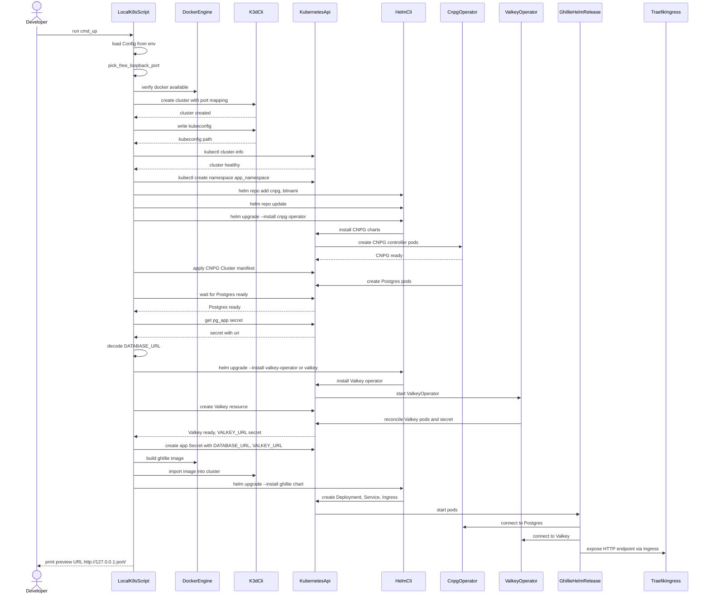
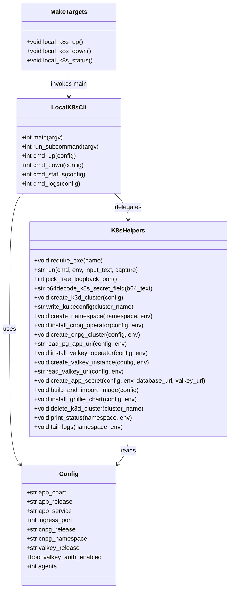

# Local k3d preview design for Ghillie

## Purpose

Define a local Kubernetes preview environment for Ghillie that uses k3d and
Helm, aligns with the cloud-native ephemeral previews architecture, and is
ready for implementation. The design documents the Helm chart shape, container
build, and a Python-based lifecycle script, plus the roadmap tasks needed to
ship the implementation.

This design is informed by the k3d Python example and the ephemeral previews
architecture for Wildside, which will also be used for Ghillie.[^k3d]
[^ephemeral]

## Goals

- Provide a repeatable local preview flow that mirrors the ephemeral previews
  environment at a functional level.
- Keep the Ghillie Helm chart compatible with FluxCD HelmRelease and Kustomize
  overlays.
- Document the interfaces for chart values, container image tags, and local
  scripts so implementation work is well-scoped.
- Decide how Valkey is provisioned in the dev cluster to reflect the platform
  approach.

## Non-goals

- Implement the Helm chart, container image, or local scripts.
- Define production SLOs or cloud networking details beyond the ephemeral
  previews architecture.
- Replace existing documentation on Ghillie ingestion, reporting, or runtime
  behaviour.

## Requirements and constraints

- Use k3d and Helm for the local cluster workflow.
- Ensure the chart and images are compatible with the GitOps workflow outlined
  in the ephemeral previews design.[^ephemeral]
- Keep platform services (CloudNativePG, Valkey, ingress, cert-manager,
  ExternalDNS, Vault, and External Secrets Operator) separate from the app
  chart, matching the platform repository boundaries.
- Provide design sketches for Helm templates, Dockerfiles, and local Python
  scripts.
- Document idempotence and recovery expectations for the local workflow.

## Design summary

The local preview environment is composed of three deliverables:

- A Ghillie Helm chart that deploys the application and reads configuration
  from values or external secrets.
- A container image that produces a runnable Ghillie artefact and a stable
  entrypoint for Kubernetes.
- A Python lifecycle script that provisions a k3d cluster, installs platform
  dependencies via Helm, deploys the chart, and surfaces the preview URL.

## Helm chart design

### Scope and boundaries

The chart deploys only the Ghillie application (Deployment, Service, Ingress,
ServiceAccount, and optional ExternalSecret). All platform services are
installed separately, either in the local k3d script or in the GitOps platform
repository.

### Values interface

The chart must support the following values, with defaults tuned for local use
and overrides for GitOps:

- `image.repository`
- `image.tag`
- `image.pullPolicy`
- `command`
- `args`
- `service.port`
- `ingress.enabled`
- `ingress.className`
- `ingress.annotations`
- `ingress.hosts`
- `ingress.tls`
- `env.normal` for non-sensitive environment values
- `secrets.existingSecretName` to bind to a pre-created Secret
- `secrets.externalSecret.*` for External Secrets Operator support
- `resources`
- `securityContext`
- `podSecurityContext`

### Ingress behaviour

The chart should support a hostless ingress for local k3d, relying on Traefik
as the default ingress controller in k3s. This mirrors the k3d example and
avoids `ingressClassName` unless explicitly configured.[^k3d].

### Secrets and configuration

The chart should load sensitive configuration via a Kubernetes Secret. In the
local flow, the lifecycle script will create that Secret using values derived
from CNPG and Valkey. In ephemeral previews, External Secrets Operator should
hydrate the Secret from Vault or another backend, controlled via the chart
values.

## Container image design

### Build strategy

Use a multi-stage Dockerfile that builds a wheel and installs it into a slim
runtime image. The runtime should use a non-root user when feasible, and the
image should expose a clear entrypoint for running Ghillie.

### Runtime entrypoints

Ghillie does not yet expose a long-running HTTP service in the repository. The
design assumes the implementation will provide a dedicated runtime entrypoint
module (for example, `ghillie.runtime`) that can run the ingestion worker,
transform worker, or a combined service profile. The chart must allow `command`
and `args` overrides so entrypoints can evolve without changing the chart.

### Image tagging

Local builds will use a `local` tag and import the image into k3d. GitOps
previews will use immutable tags (for example, commit SHA) and reference the
registry set by the CI pipeline.

## Local k3d lifecycle script design

### CLI shape

A single Python script (`scripts/local_k8s.py`) will provide subcommands:

- `up` to create a cluster and deploy Ghillie
- `down` to delete the cluster
- `status` to summarise resources
- `logs` to tail application logs

### Cluster creation and ingress

The script will create a k3d cluster with a unique name and namespace, map a
free loopback port to the k3d load balancer on port 80, and write a dedicated
kubeconfig. This mirrors the loopback-only ingress model from the k3d example.
[^k3d].

### Platform dependencies

The script will install CloudNativePG and Valkey before deploying the Ghillie
chart. CloudNativePG will create a small Postgres cluster in the app namespace
and provide a database URL via the generated `*-app` Secret.[^k3d].

### Valkey provisioning decision

To align with the ephemeral previews platform, the design adopts
`valkey-operator` for local Valkey provisioning, installed via Helm in the dev
cluster.[^valkey-operator].

Rationale:

- Ephemeral previews isolate platform services from app charts and benefit
  from operator-driven lifecycle management, which the Valkey operator provides.
- Using the operator locally reduces drift between local preview and GitOps
  environments, making failures more representative.

The local script will create the smallest supported Valkey resource (as defined
by the operator documentation) and read the generated Secret into the
application Secret. If the operator is not available in the environment, the
script should fail fast with a message explaining how to install it.

### Application secrets

The script will create a Kubernetes Secret named after the Helm release
(`ghillie` by default) containing `DATABASE_URL` and `VALKEY_URL`. The chart
will load this via `envFrom`, and `secrets.existingSecretName` will allow
override for external secret flows.

### Helm install

The script will install the Ghillie chart with a values file tailored for local
use and `image.tag=local`. It will optionally create an ingress resource if the
chart ingress is disabled (a deliberate escape hatch for charts that already
manage ingress).

### Idempotence and recovery

Running `up` should be safe when the cluster already exists. The script will
reuse the cluster or prompt for deletion, but never delete data without
explicit confirmation. Any Helm install failure should be retried after fixing
values or image tags without requiring manual clean-up.

## GitOps and ephemeral preview alignment

The same chart and image will be used in GitOps environments. The intended
alignment is:

- Platform services (CNPG, Valkey operator, ingress, cert-manager,
  ExternalDNS, Vault, External Secrets Operator) live in the platform
  repository and are installed via FluxCD HelmRelease resources.
- The Ghillie chart is deployed via a HelmRelease in the applications
  repository, patched by Kustomize overlays for production, staging, and
  ephemeral previews.
- Image tag changes are made by CI pipelines that update the HelmRelease
  values or overlays, not by manual Helm commands.

Local values will map cleanly to GitOps overlays, for example:

```yaml
# values.local.yaml
image:
  repository: ghillie
  tag: local
ingress:
  enabled: true
  hosts:
    - host: ""
      paths:
        - path: /
          pathType: Prefix
secrets:
  existingSecretName: ghillie
  externalSecret:
    enabled: false
```

```yaml
# overlays/ephemeral/pr-123/patch-values.yaml (HelmRelease values patch)
image:
  repository: ghcr.io/leynos/ghillie
  tag: sha-abc123
ingress:
  enabled: true
  hosts:
    - host: pr-123.preview.example.com
      paths:
        - path: /
          pathType: Prefix
secrets:
  existingSecretName: ghillie
  externalSecret:
    enabled: true
    secretStoreRef: platform-vault
```

## Validation expectations

The local preview workflow should be designed to make success observable via:

- `kubectl -n <namespace> get pods` showing ready pods.
- Application logs confirming the runtime entrypoint started cleanly.
- Optional HTTP health checks if a service endpoint exists.

The design does not require a specific health endpoint yet, but the entrypoint
should expose deterministic logs that confirm readiness for local preview
validation.

## Diagrams

The following sequence diagram illustrates the end-to-end local preview flow,
from invoking the local script to exposing the preview URL.



The following class diagram outlines the planned CLI and helper structure for
the local k3d script.



## Sketches

### Helm chart layout

```text
charts/ghillie/
  Chart.yaml
  values.yaml
  values.schema.json
  templates/
    _helpers.tpl
    deployment.yaml
    service.yaml
    ingress.yaml
    serviceaccount.yaml
    externalsecret.yaml
    configmap.yaml
```

### Chart metadata sketch

```yaml
apiVersion: v2
name: ghillie
description: Ghillie application chart
type: application
version: 0.1.0
appVersion: "0.1.0"
```

### Deployment template sketch

```yaml
spec:
  template:
    spec:
      serviceAccountName: {{ include "ghillie.serviceAccountName" . }}
      containers:
        - name: ghillie
          image: "{{ .Values.image.repository }}:{{ .Values.image.tag }}"
          imagePullPolicy: {{ .Values.image.pullPolicy }}
          command: {{ toJson .Values.command }}
          args: {{ toJson .Values.args }}
          envFrom:
            - secretRef:
                name: {{ include "ghillie.fullname" . }}
          env:
            - name: GHILLIE_ENV
              value: {{ .Values.env.normal.GHILLIE_ENV | quote }}
          ports:
            - containerPort: {{ .Values.service.port }}
```

### Ingress template sketch

```yaml
apiVersion: networking.k8s.io/v1
kind: Ingress
metadata:
  name: {{ include "ghillie.fullname" . }}
spec:
  rules:
    - {{- if .Values.ingress.hosts }}
      host: {{ (index .Values.ingress.hosts 0).host | quote }}
      {{- end }}
      http:
        paths:
          - path: /
            pathType: Prefix
            backend:
              service:
                name: {{ include "ghillie.fullname" . }}
                port:
                  number: {{ .Values.service.port }}
```

### ExternalSecret template sketch

```yaml
apiVersion: external-secrets.io/v1beta1
kind: ExternalSecret
metadata:
  name: {{ include "ghillie.fullname" . }}
spec:
  refreshInterval: 1h
  secretStoreRef:
    name: {{ .Values.secrets.externalSecret.secretStoreRef }}
    kind: ClusterSecretStore
  target:
    name: {{ include "ghillie.fullname" . }}
  data:
    {{- toYaml .Values.secrets.externalSecret.data | nindent 4 }}
```

### Dockerfile sketch

```dockerfile
FROM python:3.12-slim AS build
WORKDIR /build
RUN pip install --upgrade pip
COPY pyproject.toml README.md /build/
COPY ghillie /build/ghillie
RUN pip wheel --wheel-dir /wheels .

FROM python:3.12-slim
WORKDIR /app
RUN pip install --no-cache-dir /wheels/*.whl
COPY docker/entrypoint.sh /usr/local/bin/ghillie-entrypoint
ENTRYPOINT ["ghillie-entrypoint"]
CMD ["python", "-m", "ghillie.runtime"]
```

### Local k3d script sketch

```python
@dataclass(frozen=True)
class Config:
    cluster_name: str
    namespace: str
    ingress_port: int | None
    chart_path: str
    image_repo: str
    image_tag: str
    cnpg_release: str
    valkey_release: str


def cmd_up(cfg: Config) -> None:
    require_exe("docker")
    require_exe("k3d")
    require_exe("kubectl")
    require_exe("helm")
    port = cfg.ingress_port or pick_free_loopback_port()
    create_k3d_cluster(cfg.cluster_name, port)
    kube_env = kubeconfig_env(cfg.cluster_name)
    install_cnpg(kube_env)
    create_pg_cluster(kube_env, cfg.namespace)
    install_valkey_operator(kube_env)
    create_valkey_instance(kube_env, cfg.namespace)
    create_app_secret(kube_env, cfg.namespace)
    build_and_import_image(cfg.cluster_name, cfg.image_repo, cfg.image_tag)
    install_ghillie_chart(kube_env, cfg.namespace, cfg.chart_path, cfg)
```

## Risks and mitigations

- Risk: The current codebase lacks a stable runtime entrypoint. Mitigation:
  define a minimal `ghillie.runtime` module as part of implementation and keep
  the chart command configurable.
- Risk: Valkey operator CRDs may differ from assumptions. Mitigation: confirm
  operator resource names during the implementation task and reflect them in
  the local script and chart documentation.
- Risk: Local ingress behaviour drifts from the cloud environment. Mitigation:
  use hostless ingress locally and explicit hostnames in GitOps overlays.

## References

[^k3d]: `docs/k3d-python-example.md`.
[^ephemeral]: `../wildside/docs/cloud-native-ephemeral-previews.md`.
[^valkey-operator]: <https://github.com/hyperspike/valkey-operator>.
